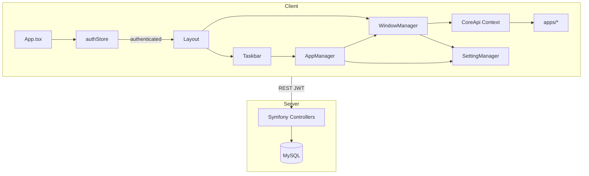
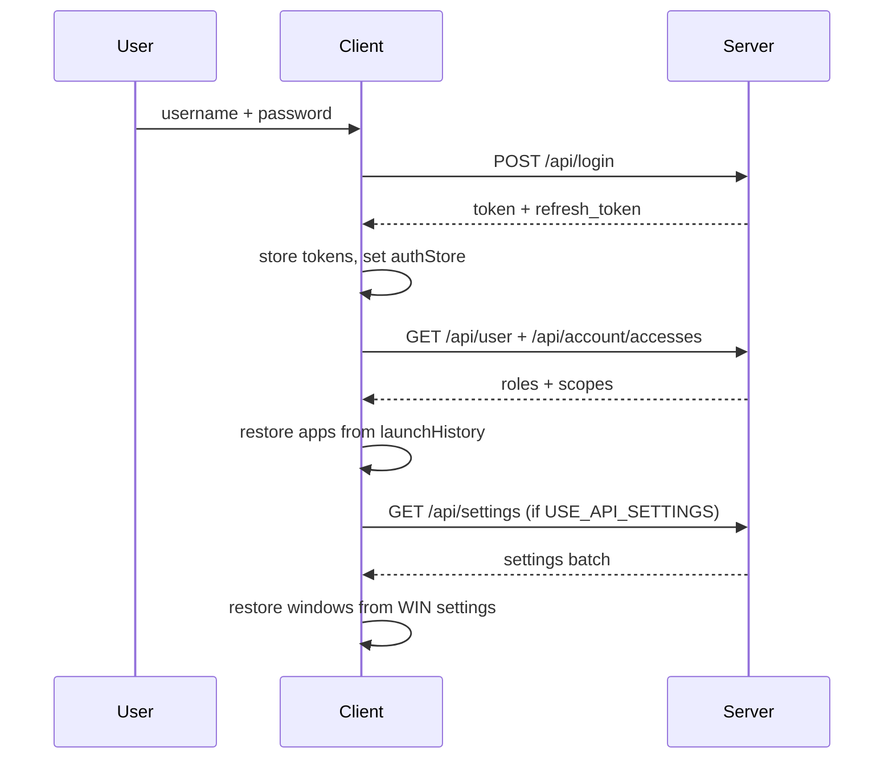
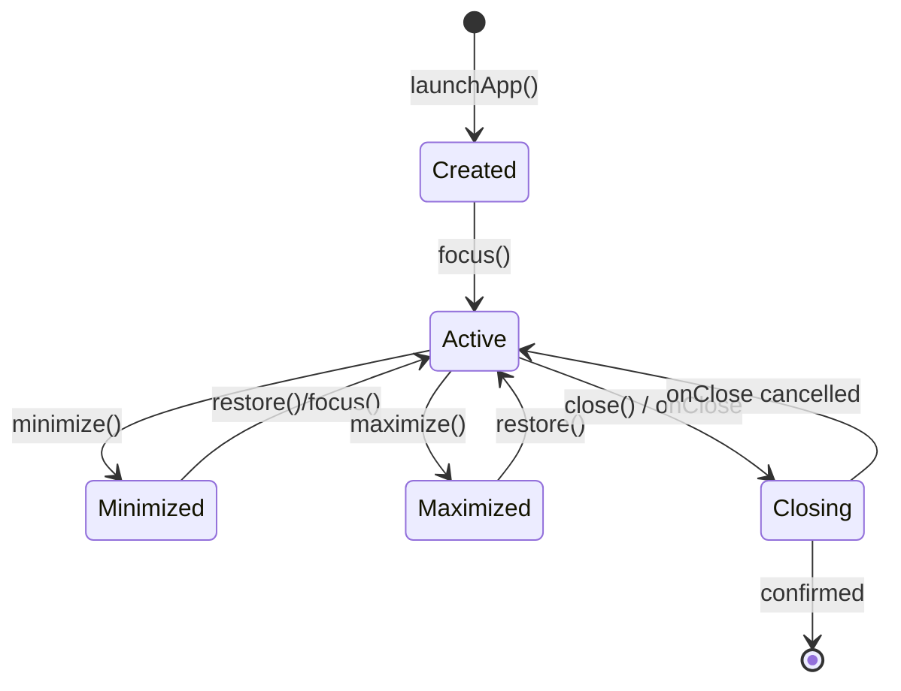

# XOS — Архитектура системы

> Версия: 2026-07-14  
> Статус: проектирование (pre-implementation)

## 1. Обзор решения

XOS — CRM с **десктоп-окружением в браузере**. Клиент-серверная архитектура:

- **Backend:** Symfony 7.3, Doctrine ORM, MySQL, JWT (Lexik + Gesdinet refresh)
- **Frontend:** React 19 + TypeScript, Vite 8, Tailwind 4, Mantine 9, Zustand 5, TanStack Query 5

**Ключевые решения:**

1. **Полная перезапись клиента** по структуре ТЗ (`client/src/core/*` + `client/src/apps/*`), текущий код — reference для бизнес-логики, не для копирования структуры.
2. **SPA без роутинга:** `App.tsx` переключает `<LoginScreen />` ↔ `<Desktop />` по `authStore.isAuthenticated`.
3. **Настройки:** LocalStorage по умолчанию; опционально ApiAdapter → `user_settings` (новая сущность).
4. **API prefix:** все эндпоинты под `/api/*`; Device-маршруты **мигрировать** с `/device/*` (см. API_SPEC.md).
5. **Code splitting:** приложения через `import.meta.glob('../apps/*/index.ts')`, lazy load по launch.



---

## 2. Компоненты системы

### 2.1 Backend-модули

| Модуль | Ответственность | Статус |
|--------|-----------------|--------|
| **App** | Auth, Account, Settings `[NEW]`, RefreshToken | Auth частично (login через firewall; logout/settings — TODO) |
| **Main** | User, Group, OU, Role, Claimant, File | CRUD реализован |
| **Device** | Device, License, Software, Properties | CRUD реализован, routes без `/api` |
| **IBlock** | Block, Element, Section, Property | Сущности есть, API — TODO |

### 2.2 Frontend Core

| Модуль | Файлы | Ответственность |
|--------|-------|-----------------|
| **api** | `core/api/client.ts`, `endpoints/*` | Axios, interceptors, typed endpoints |
| **auth** | `core/auth/*` | Login/logout, token storage, roles/scopes helpers |
| **settings** | `core/settings/*` | SettingManager, adapters, hooks |
| **windowManager** | `core/windowManager/*` | Zustand store, Window (react-rnd), WindowApi |
| **appManager** | `core/appManager/*` | Registry, launch, singleInstance, history |
| **taskbar** | `core/taskbar/*` | Start menu, running apps, wmGroup |
| **layout** | `core/layout/*` | CSS Grid parser, resizable panels |
| **desktop** | `core/desktop/*` | Desktop surface, icons (optional) |
| **context/hooks** | `core/context/*`, `core/hooks/*` | CoreApiContext, useCoreApi |

### 2.3 Бизнес-приложения (`apps/`)

Изолированные модули с манифестом. Примеры первой волны:

- `apps/users` — CRUD пользователей (Main API)
- `apps/settings` — профиль + UI preferences
- `apps/devices` — устройства (Device API)
- `apps/demo-calculator` — demo без API

---

## 3. Data Flow

### 3.1 Auth Flow



**Logout:** GET `/api/logout` (когда реализован) → clear tokens → reset stores → LoginScreen.

**401 handling:** очередь refresh (`POST /api/token/refresh`) → retry original request; при failure — logout.

### 3.2 Window Lifecycle



**Persist:** каждое изменение position/size/state → debounce 300ms → `SettingManager.set('WIN', appId, state)`.

**Child windows:** `windowApi.createChildWindow()` — React portal внутри parent Window, **не** в wmStore, **не** в taskbar.

### 3.3 Settings Priority

```
USER > APP > WIN > HKEY_CONFIG
```

```typescript
// SettingManager.get(category, key)
// 1. Check USER store
// 2. Fallback APP → WIN → HKEY_CONFIG defaults from config/defaults.ts
```

**Adapters:**

| Adapter | Read | Write | Use case |
|---------|------|-------|----------|
| LocalStorageAdapter | sync | sync | Default, offline |
| ApiAdapter | async + cache | async debounced | Multi-device sync |
| CompositeAdapter | local first | both | Optimistic + sync |

`USE_API_SETTINGS=true` в `.env` → Composite(local, api).

---

## 4. CoreApi

```typescript
// core/context/types.ts

export interface CoreApi {
  http: AxiosInstance;
  toast: {
    show: (payload: NotificationData) => void;
    success: (message: string) => void;
    error: (message: string) => void;
    info: (message: string) => void;
    warning: (message: string) => void;
  };
  auth: {
    getUser: () => UserSummary | null;
    logout: () => Promise<void>;
  };
  window: WindowApi;
  roles: {
    isRole: (role: string) => boolean;
    isRoot: () => boolean;
    isAdmin: (mod?: string) => boolean;
  };
  scopes: {
    checkHasScope: (scope: string) => boolean;
    getLevelScope: (scope: string) => number;
    getCanScope: (scope: string) => number;
  };
  settings: SettingManager;
}

export interface WindowApi {
  close: (force?: boolean) => Promise<boolean>;
  minimize: () => void;
  maximize: () => void;
  restore: () => void;
  refresh: () => void;
  setTitle: (title: string) => void;
  setSize: (width: number, height: number) => void;
  setPosition: (x: number, y: number) => void;
  on: (event: WindowEvent, handler: () => void) => () => void;
  off: (event: WindowEvent, handler: () => void) => void;
  createChildWindow: (options: ChildWindowOptions) => ChildWindowHandle;
}

export interface AppManifest {
  id: string;
  name: string;
  version: string;
  icon: React.ComponentType | string;
  component: React.LazyExoticComponent<React.ComponentType<{ coreApi: CoreApi }>>;
  defaultSize: { width: number; height: number };
  minSize?: { width: number; height: number };
  requiredRole?: string;
  requiredScope?: string;
  wmGroup?: string;
  singleInstance?: boolean;
  instanceKey?: string | ((params?: LaunchParams) => string);
}
```

---

## 5. Zustand Stores

### wmStore (`core/windowManager/useWmStore.ts`)

```typescript
interface WindowState {
  id: string;
  appId: string;
  instanceKey: string;
  title: string;
  x: number; y: number; width: number; height: number;
  zIndex: number;
  minimized: boolean;
  maximized: boolean;
  wmGroup: string;
  wmSort: number;
}

interface WmStore {
  windows: Record<string, WindowState>;
  activeWindowId: string | null;
  openWindow: (payload: OpenWindowPayload) => string;
  closeWindow: (id: string) => void;
  focusWindow: (id: string) => void;
  updateWindow: (id: string, patch: Partial<WindowState>) => void;
  minimizeWindow: (id: string) => void;
  maximizeWindow: (id: string) => void;
  restoreWindow: (id: string) => void;
}
```

### appStore (`core/appManager/useAppManager.ts`)

```typescript
interface AppManagerStore {
  registry: Map<string, AppManifest>;
  running: Array<{ windowId: string; appId: string; instanceKey: string }>;
  registerApps: (manifests: AppManifest[]) => void;
  launchApp: (appId: string, params?: LaunchParams) => Promise<string | null>;
  restoreFromHistory: () => Promise<void>;
}
```

### authStore (`core/auth/authStore.ts`)

```typescript
interface AuthStore {
  user: UserSummary | null;
  scopes: Record<string, number>;
  isAuthenticated: boolean;
  isLoading: boolean;
  login: (credentials: LoginRequest) => Promise<void>;
  logout: () => Promise<void>;
  hydrate: () => Promise<void>;
}
```

---

## 6. Технологический стек (клиент)

### 6.1 Рекомендуемый `package.json` (июль 2026)

```json
{
  "dependencies": {
    "@mantine/core": "^9.4.1",
    "@mantine/form": "^9.4.1",
    "@mantine/hooks": "^9.4.1",
    "@mantine/modals": "^9.4.1",
    "@mantine/notifications": "^9.4.1",
    "@tanstack/react-query": "^5.101.2",
    "axios": "^1.18.1",
    "clsx": "^2.1.1",
    "dayjs": "^1.11.13",
    "react": "^19.2.7",
    "react-dom": "^19.2.7",
    "react-rnd": "^10.5.3",
    "react-window": "^2.2.7",
    "zod": "^4.4.3",
    "zustand": "^5.0.14"
  },
  "devDependencies": {
    "@eslint/js": "^9.28.0",
    "@tailwindcss/vite": "^4.3.2",
    "@types/react": "^19.2.17",
    "@types/react-dom": "^19.2.17",
    "@vitejs/plugin-react": "^6.0.3",
    "eslint": "^9.28.0",
    "eslint-config-mantine": "^4.0.3",
    "eslint-plugin-react-hooks": "^5.2.0",
    "eslint-plugin-react-refresh": "^0.4.19",
    "globals": "^16.0.0",
    "mantine-form-zod-resolver": "^1.3.0",
    "postcss": "^8.5.19",
    "postcss-preset-mantine": "^1.17.0",
    "postcss-simple-vars": "^7.0.1",
    "prettier": "^3.5.3",
    "tailwindcss": "^4.3.2",
    "typescript": "~5.8.3",
    "typescript-eslint": "^8.33.1",
    "vite": "^8.1.4"
  }
}
```

**Удалить из текущего client:** `react-draggable`, `react-resizable`, `@dnd-kit/*`, `@tiptap/*`, `recharts`, `@mantine/carousel|charts|code-highlight|dropzone|nprogress|spotlight|tiptap`, `prop-types`, `uuid` (заменить на `crypto.randomUUID`).

**Опционально в apps:** `@mantine/dates`, `recharts` — только в приложениях, где нужны (lazy).

### 6.2 TypeScript (`tsconfig.json`)

```json
{
  "compilerOptions": {
    "target": "ES2022",
    "lib": ["ES2022", "DOM", "DOM.Iterable"],
    "module": "ESNext",
    "moduleResolution": "bundler",
    "strict": true,
    "noUncheckedIndexedAccess": true,
    "noImplicitOverride": true,
    "verbatimModuleSyntax": true,
    "jsx": "react-jsx",
    "paths": { "@/*": ["./src/*"] },
    "types": ["vite/client"]
  },
  "include": ["src"]
}
```

### 6.3 Vite (`vite.config.ts` outline)

```typescript
import { defineConfig } from 'vite';
import react from '@vitejs/plugin-react';
import tailwindcss from '@tailwindcss/vite';
import path from 'node:path';

export default defineConfig({
  plugins: [react(), tailwindcss()],
  resolve: { alias: { '@': path.resolve(__dirname, 'src') } },
  server: {
    port: 5173,
    proxy: { '/api': 'http://localhost:8000', '/device': 'http://localhost:8000' },
  },
  build: {
    target: 'es2022',
    rollupOptions: {
      output: {
        manualChunks: {
          vendor: ['react', 'react-dom'],
          mantine: ['@mantine/core', '@mantine/hooks'],
          query: ['@tanstack/react-query'],
        },
      },
    },
  },
});
```

### 6.4 Tailwind — window breakpoints

`styles/window-breakpoints.css` + `tailwind.config` (v4 `@theme`):

```css
@theme {
  --breakpoint-window-sm: 640px;
  --breakpoint-window-md: 768px;
  --breakpoint-window-lg: 1024px;
}
```

Использование: `@media (min-width: var(--breakpoint-window-sm))` или custom variant `window:`.

### 6.5 Bundle < 200KB gzip

- Mantine: импорт только `@mantine/core` + `@mantine/notifications`, CSS через PostCSS preset
- Lazy: все `apps/*`, `@mantine/modals` при первом modal
- `react-window` — dynamic import в таблицах
- Анализ: `vite-bundle-visualizer` на CI

---

## 7. Файловая структура клиента

```
client/
├── index.html
├── package.json
├── vite.config.ts
├── tsconfig.json
├── eslint.config.js
├── postcss.config.cjs
├── .env                          # VITE_API_URL, VITE_USE_API_SETTINGS
└── src/
    ├── main.tsx
    ├── App.tsx
    ├── config/
    │   └── defaults.ts           # HKEY_CONFIG defaults
    ├── core/
    │   ├── api/
    │   │   ├── client.ts
    │   │   ├── interceptors.ts
    │   │   └── endpoints/
    │   │       ├── auth.ts
    │   │       ├── account.ts
    │   │       ├── settings.ts
    │   │       ├── main.ts
    │   │       └── device.ts
    │   ├── auth/
    │   │   ├── authStore.ts
    │   │   ├── coreRoles.ts
    │   │   ├── coreScopes.ts
    │   │   └── LoginScreen.tsx
    │   ├── settings/
    │   │   ├── SettingManager.ts
    │   │   ├── Setting.ts
    │   │   ├── Config.ts
    │   │   ├── hooks.ts          # useSetting, useSetState
    │   │   └── adapters/
    │   │       ├── ISettingAdapter.ts
    │   │       ├── LocalStorageAdapter.ts
    │   │       ├── ApiAdapter.ts
    │   │       └── CompositeAdapter.ts
    │   ├── windowManager/
    │   │   ├── useWmStore.ts
    │   │   ├── Window.tsx
    │   │   ├── WindowApi.ts
    │   │   ├── WindowErrorBoundary.tsx
    │   │   ├── useWindowSize.ts
    │   │   └── ChildWindowPortal.tsx
    │   ├── appManager/
    │   │   ├── useAppManager.ts
    │   │   ├── AppRegistry.ts
    │   │   ├── registerApps.ts   # import.meta.glob
    │   │   └── launchHistory.ts
    │   ├── layout/
    │   │   ├── Layout.tsx
    │   │   ├── LayoutArea.tsx
    │   │   ├── ResizablePanel.tsx
    │   │   └── parseView.ts
    │   ├── taskbar/
    │   │   ├── Taskbar.tsx
    │   │   ├── StartMenu.tsx
    │   │   └── RunningApps.tsx
    │   ├── desktop/
    │   │   └── Desktop.tsx
    │   ├── context/
    │   │   ├── CoreApiContext.tsx
    │   │   ├── AppContext.tsx
    │   │   └── createCoreApi.ts
    │   ├── hooks/
    │   │   ├── useCoreApi.ts
    │   │   └── useApp.ts
    │   └── index.ts
    ├── apps/
    │   ├── users/
    │   │   ├── index.ts          # export manifest
    │   │   ├── UsersApp.tsx
    │   │   ├── hooks/
    │   │   ├── services/
    │   │   └── types/
    │   └── settings/
    │       └── ...
    ├── components/
    │   ├── ui/                   # Mantine wrappers
    │   ├── forms/
    │   └── tables/
    │       └── VirtualTable.tsx  # react-window
    ├── hooks/
    ├── services/
    ├── utils/
    ├── styles/
    │   ├── globals.css
    │   ├── theme.ts
    │   └── window-breakpoints.css
    └── types/
        ├── api.types.ts
        └── core.types.ts
```

---

## 8. Миграция с текущего клиента

| Текущее | Действие |
|---------|----------|
| `core/window-system/` | **Удалить** → `core/windowManager/` (react-rnd) |
| `core/app-system/` | **Удалить** → `core/appManager/` |
| `core/setting-system/` | **Переиспользовать логику** Setting/Config → `core/settings/` + TS strict |
| `core/auth-system/`, `roles-system/`, `scopes-system/` | **Объединить** → `core/auth/` |
| `components/window/`, `window-manager/` | **Удалить** → core/windowManager |
| `components/layout/` | **Портировать** parseView/sidebar → `core/layout/` |
| `utils/debounce.ts`, `is.ts`, `string.ts` | **Перенести** в `utils/` |
| `utils/Axios-Interceptor.ts` | **Переписать** → `core/api/interceptors.ts` |
| `apps/tic-tac-toe`, `sudoku`, `calculator` | **Переписать на TS** как demo или удалить |
| `main.jsx` | **Заменить** на `main.tsx` |

---

## 9. Backend — доработки (не переписывать)

1. **LoginSuccessHandler** — вернуть user + scopes в ответе login
2. **Logout** — активировать в security.yaml + LogoutHandler
3. **ApiSettingsController** + UserSetting entity + migration
4. **Device routes** — prefix `/api/device`, JWT firewall
5. **IBlock** — controllers + fix entity namespaces
6. **GET /api/user** — расширить (login, alias, scopes)

---

## 10. Производительность окон (60 FPS)

- `react-rnd` с `enableUserSelectHack={false}`, `dragHandleClassName`
- Persist position on `onDragStop` / `onResizeStop`, не onDrag
- `will-change: transform` только во время drag
- Мemoize `Window` через `React.memo`, стабильные callbacks
- Лимит **20** глобальных окон (warning toast)
- zIndex: `baseZ + index` из wmStore

---

## 11. Открытые решения

| # | Вопрос | Рекомендация |
|---|--------|--------------|
| 1 | Token storage: localStorage vs httpOnly cookies | **localStorage** для SPA + короткий TTL (15 мин); cookies — phase 2 с SameSite |
| 2 | `/api/refresh-token` vs `/api/token/refresh` | Использовать **Gesdinet path** `/api/token/refresh` |
| 3 | Device API path | Миграция на `/api/device/*` с alias redirect на старые пути |
| 4 | User.options vs user_settings | Разделить: profile options vs desktop UI state |
| 5 | i18n | Отложить; структура `src/i18n/` зарезервирована |
| 6 | Demo apps | Оставить 1 demo (calculator) для тестирования WM |
| 7 | Mantine 8→9 | Обновить до **9.4.1**, проверить breaking changes Form/Styles |

---

## 12. Ссылки

- [DATABASE_SCHEMA.md](./DATABASE_SCHEMA.md)
- [API_SPEC.md](./API_SPEC.md)
- [PLAN.md](./PLAN.md)
- [TZ.md](./TZ.md)
