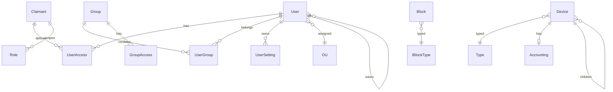

# XOS — Схема базы данных (Doctrine ORM)

> Версия: 2026-08-06 (добавлено `main_claimant.access_options`)  
> СУБД: MySQL 8.x  
> ORM: Doctrine 3.4, миграции через `doctrine:migrations`

## Обзор

Схема отражает **существующие** Doctrine-сущности в `server/src/` и **новую** сущность `UserSetting` для ApiAdapter настроек клиента (требование ТЗ §4.1.2, §5.3).

### Модули

| Модуль | Namespace | Таблицы |
|--------|-----------|---------|
| App | `App\Entity` | `refresh_tokens` |
| Main | `Main\Entity` | `main_user`, `main_user_access`, `main_user_group`, `main_group`, `main_group_access`, `main_role`, `main_claimant`, `main_ou`, `main_file`, `main_stored_auth` |
| Device | `Device\Entity` | `d_device`, `d_type`, `d_type_property`, `d_property`, `d_property_enum`, `d_license`, `d_license_key`, `d_license_software`, `d_software`, `d_software_type`, `d_accounting`, `d_device_*` (вложенные) |
| IBlock | `IBlock\Entity` | `iblock_block`, `iblock_type`, `iblock_element`, `iblock_section`, `iblock_property`, `iblock_property_enum` |
| **Новое** | `App\Entity` | `user_settings` |

---

## App — Аутентификация

### RefreshToken (`refresh_tokens`)

Наследует `Gesdinet\JWTRefreshTokenBundle\Entity\RefreshToken`.

| Поле | Тип | Описание |
|------|-----|----------|
| id | INT PK | |
| refresh_token | VARCHAR(128) UNIQUE | Хеш refresh-токена |
| username | VARCHAR(255) | Login пользователя |
| valid | DATETIME | Срок действия |

**Конфиг:** TTL 7200 с, `single_use: true` (`gesdinet_jwt_refresh_token.yaml`).

---

## Main — Пользователи и права

### User (`main_user`)

| Поле | Тип | Nullable | Описание |
|------|-----|----------|----------|
| id | INT PK | | |
| login | VARCHAR(191) UNIQUE | | Идентификатор для входа (`username` в JSON login) |
| email | VARCHAR(255) | ✓ | |
| password | VARCHAR(255) | ✓ | Хеш (Symfony Password Hasher) |
| salt | VARCHAR(255) | ✓ | Legacy |
| alias | VARCHAR(255) | ✓ | Отображаемое имя |
| first_name, second_name, patronymic | VARCHAR(255) | ✓ | ФИО |
| description | TEXT | ✓ | |
| phone | VARCHAR(255) | ✓ | |
| gender | CHAR(1) | | default `N` |
| country | VARCHAR(10) | | default `RU` |
| active | BOOLEAN | | default true |
| loocked | BOOLEAN | | default false (опечатка в БД — сохранять) |
| login_attempts | INT | | default 0 |
| active_from, active_to | DATETIME | ✓ | Период активности |
| date_register, last_login | DATETIME | ✓ | |
| last_ip | VARCHAR(40) | ✓ | |
| stored_hash, checkword | VARCHAR(32) UNIQUE | ✓ | Восстановление пароля |
| x_timestamp | DATETIME | ✓ | Optimistic lock (@Version) |
| roles | JSON | | Массив строк ролей |
| options | JSON | | Произвольные опции пользователя (legacy, `/api/account/options`) |
| parent_id | FK → main_user | ✓ | Tutor (иерархия пользователей) |
| ou_id | FK → main_ou | ✓ | Организационная единица |

**Связи:**
- `OneToMany` → `User\Access` (accesses)
- `OneToMany` → `User\Group` (groups)
- `OneToMany` → `User` (children, self-ref)
- `ManyToOne` → `OU`

**Бизнес-правила:**
- `getRoles()` всегда добавляет `ROLE_USER`.
- Иерархия ролей на сервере: `ROLE_ADMIN` → `ROLE_USER` (`security.yaml`).
- Пароль обновляется через `UserPasswordHasherInterface` + `upgradePassword()`.

### User\Access (`main_user_access`)

| Поле | Тип | Описание |
|------|-----|----------|
| id | INT PK | |
| user_id | FK → main_user CASCADE | |
| claimant_id | FK → main_claimant CASCADE | |
| level | INT | Битовая маска уровня доступа (scope) |

**Unique:** `(user_id, claimant_id)`

### Claimant (`main_claimant`)

| Поле | Тип | Nullable | Описание |
|------|-----|----------|----------|
| id | INT PK | | |
| code | VARCHAR(191) UNIQUE | | Код scope (ключ в `/api/account/accesses`, напр. `main.user`, `device`) |
| name | VARCHAR(255) | | Человекочитаемое имя |
| access_options | JSON | нет (после backfill) | Каталог `can_*` → `{ bit, title[, description] }` для UI; default `{}` |

**Источник:** sync из `server/src/*/setting.json` (`claimant` + нормализованный `map-access`).  
**Orphan:** запись не удаляется sync; при отсутствии code в файлах `access_options` сбрасывается в `{}`.  
**Не хранит** выданные пользователю маски — только описание допустимых битов (см. `User\Access.level` / `Group\Access.level`).

Подробности нормализации и default titles: `docs/ARCHITECTURE.md` (ADR access_options).

### Role (`main_role`)

| Поле | Тип | Описание |
|------|-----|----------|
| id | INT PK | |
| code | VARCHAR(191) | Код роли в контексте claimant |
| claimant_id | FK → main_claimant CASCADE | |
| level | INT | Уровень доступа роли |

**Unique:** `(code, claimant_id)`

### Group (`main_group`)

| Поле | Тип | Описание |
|------|-----|----------|
| id | INT PK | |
| code | VARCHAR(191) UNIQUE | |
| name | VARCHAR(255) | |
| description | TEXT | ✓ |
| sort, level | INT | |
| anonymous, active | BOOLEAN | |
| active_from, active_to | DATETIME | ✓ |
| x_timestamp | DATETIME | @Version |
| user_id | FK → main_user SET NULL | Владелец |
| ou_id | FK → main_ou SET NULL | |
| parent_id | FK → main_group SET NULL | Иерархия групп |

**Связи:** `OneToMany` → `Group\Access`, `User\Group`; self-ref parent/children.

### Group\Access (`main_group_access`)

Аналогично `User\Access`, но для группы: `(group_id, claimant_id)` → level.

### User\Group (`main_user_group`)

| Поле | Тип | Описание |
|------|-----|----------|
| id | INT PK | |
| user_id | FK → main_user | |
| group_id | FK → main_group | |

### OU (`main_ou`)

| Поле | Тип | Описание |
|------|-----|----------|
| id | INT PK | |
| code | VARCHAR(191) UNIQUE | |
| name | VARCHAR(255) | |
| description | TEXT | ✓ |
| sort | INT | default 100 |
| is_tutors | BOOLEAN | default false |
| x_timestamp | DATETIME | @Version |
| user_id | FK → main_user SET NULL | |

### File (`main_file`)

| Поле | Тип | Описание |
|------|-----|----------|
| id | INT PK | |
| module | VARCHAR(255) | Модуль-владелец |
| original_name, stored_name | VARCHAR | |
| content_type | VARCHAR(255) | |
| file_size | INT | |
| width, height | INT | |
| date_upload | DATETIME | |
| x_timestamp | DATETIME | @Version |
| created_by, modified_by | FK → main_user SET NULL | |

### StoredAuth (`main_stored_auth`)

Remember-me / stored sessions (связь с User, опционально для будущего).

---

## Device — Устройства

### Device (`d_device`)

| Поле | Тип | Описание |
|------|-----|----------|
| id | INT PK | |
| code | VARCHAR(191) | Unique с group_id |
| name | VARCHAR(255) | ✓ |
| sn | VARCHAR(191) | Serial, unique с type_id |
| sort | INT | default 100 |
| description | TEXT | ✓ |
| x_timestamp, date_created | DATETIME | |
| parent_id | FK → d_device SET NULL | Иерархия |
| type_id | FK → d_type RESTRICT | |
| group_id | FK → d_type SET NULL | |
| accounting_id | FK → d_accounting CASCADE | OneToOne |
| created_by, modified_by | FK → main_user SET NULL | |

**Вложенные сущности:** `Device\Property`, `Device\License`, `Device\Location`, `Device\Repair`, `Device\History`.

### Type (`d_type`)

Иерархический справочник типов/групп устройств. Связи: `Property` (ManyToMany через `d_type_property`), self-ref parent/children.

### Property (`d_property`), PropertyEnum (`d_property_enum`)

Схема свойств устройств с перечислениями.

### License (`d_license`)

| Поле | Тип | Описание |
|------|-----|----------|
| id | INT PK | |
| code | VARCHAR(191) UNIQUE | |
| type, aut_no, no | VARCHAR(255) | |
| date_real | DATETIME | ✓ |
| sort | INT | |

**Связи:** `License\Key`, `License\Software` → `Software`.

### Software (`d_software`), Software\Type (`d_software_type`)

Справочник ПО и типов ПО.

### Accounting (`d_accounting`)

Бухгалтерский учёт, OneToOne с Device.

---

## IBlock — Информационные блоки

> Сущности в `server/src/IBlock/Entity/`. Часть файлов использует namespace `App\Entity\iBlock` — **требуется унификация** на `IBlock\Entity` при доработке. Контроллеры **отсутствуют**.

### Block (`iblock_block`)

| Поле | Тип | Описание |
|------|-----|----------|
| id | INT PK | |
| code | VARCHAR(191) UNIQUE | |
| name | VARCHAR(255) | |
| description | TEXT | ✓ |
| sort | INT | |
| active, sections, property | BOOLEAN | |
| active_from, active_to | DATETIME | ✓ |
| type_id | FK → iblock_type CASCADE | |
| x_timestamp, date_created | DATETIME | |

### Type, Element, Section, Property, Property\Enum

Стандартная модель инфоблока: тип → блок → секции/элементы → свойства (с enum для списков).

---

## Новая сущность: UserSetting (`user_settings`)

Для клиентского SettingManager (ApiAdapter). Отдельно от JSON-поля `User.options` (которое остаётся для legacy account options).

```php
// server/src/App/Entity/UserSetting.php
namespace App\Entity;

#[ORM\Entity(repositoryClass: App\Repository\UserSettingRepository::class)]
#[ORM\Table(name: 'user_settings')]
#[ORM\UniqueConstraint(name: 'uniq_user_category_key', columns: ['user_id', 'category', 'setting_key'])]
#[ORM\Index(name: 'idx_user_category', columns: ['user_id', 'category'])]
class UserSetting
{
    public const CATEGORY_USER = 'USER';
    public const CATEGORY_APP = 'APP';
    public const CATEGORY_WIN = 'WIN';
    public const CATEGORY_HKEY_CONFIG = 'HKEY_CONFIG';

    #[ORM\Id, ORM\GeneratedValue, ORM\Column]
    private ?int $id = null;

    #[ORM\ManyToOne(targetEntity: Main\Entity\User::class)]
    #[ORM\JoinColumn(name: 'user_id', nullable: false, onDelete: 'CASCADE')]
    private User $user;

    #[ORM\Column(length: 32)]
    private string $category; // USER | APP | WIN | HKEY_CONFIG

    #[ORM\Column(name: 'setting_key', length: 512)]
    private string $key; // dot-path, напр. "users.position" или "layout.left.width"

    #[ORM\Column(type: Types::JSON)]
    private mixed $value = null;

    #[ORM\Column(name: 'updated_at', type: Types::DATETIME_IMMUTABLE)]
    private \DateTimeImmutable $updatedAt;
}
```

### Ключи настроек (соглашение)

| Категория | Примеры ключей | Назначение |
|-----------|----------------|------------|
| WIN | `{appId}` | Состояние окна приложения (position, size, state, wmGroup, wmSort) |
| APP | `launchHistory`, `{appId}.state` | История запусков, состояние приложения |
| USER | `layout.view`, `layout.mobileView`, `layout.panels.left.width` | Макет рабочего стола |
| HKEY_CONFIG | `defaults.*` | Серверные дефолты (опционально, read-only для клиента) |

**Приоритет чтения на клиенте:** USER > APP > WIN > HKEY_CONFIG (ТЗ §4.2.6).

### Миграция

```sql
CREATE TABLE user_settings (
    id INT AUTO_INCREMENT PRIMARY KEY,
    user_id INT NOT NULL,
    category VARCHAR(32) NOT NULL,
    setting_key VARCHAR(512) NOT NULL,
    value JSON NOT NULL,
    updated_at DATETIME NOT NULL COMMENT '(DC2Type:datetime_immutable)',
    CONSTRAINT FK_user_settings_user FOREIGN KEY (user_id) REFERENCES main_user(id) ON DELETE CASCADE,
    UNIQUE INDEX uniq_user_category_key (user_id, category, setting_key),
    INDEX idx_user_category (user_id, category)
) ENGINE=InnoDB DEFAULT CHARSET=utf8mb4 COLLATE=utf8mb4_unicode_ci;
```

---

## ER-диаграмма (упрощённая)



---

## Индексы и каскады (рекомендации)

1. **user_settings:** unique `(user_id, category, setting_key)` — upsert по ключу.
2. **main_user.login** — уже unique, используется Security provider.
3. **Device:** при удалении type с RESTRICT — блокировать удаление типа с устройствами.
4. **Optimistic locking:** `x_timestamp` @Version на User, Group, OU, Device, Block — учитывать при PUT.

---

## Открытые решения

| Вопрос | Рекомендация |
|--------|--------------|
| Дублирование `User.options` vs `user_settings` | `options` — профильные опции аккаунта; `user_settings` — UI/desktop state. Не мигрировать автоматически. |
| IBlock namespace | Унифицировать на `IBlock\Entity`, добавить `#[ORM\Entity]` где отсутствует. |
| Device routes без `/api` | Перенести под `/api/device/*` и единый JWT-firewall (см. ARCHITECTURE.md). |
