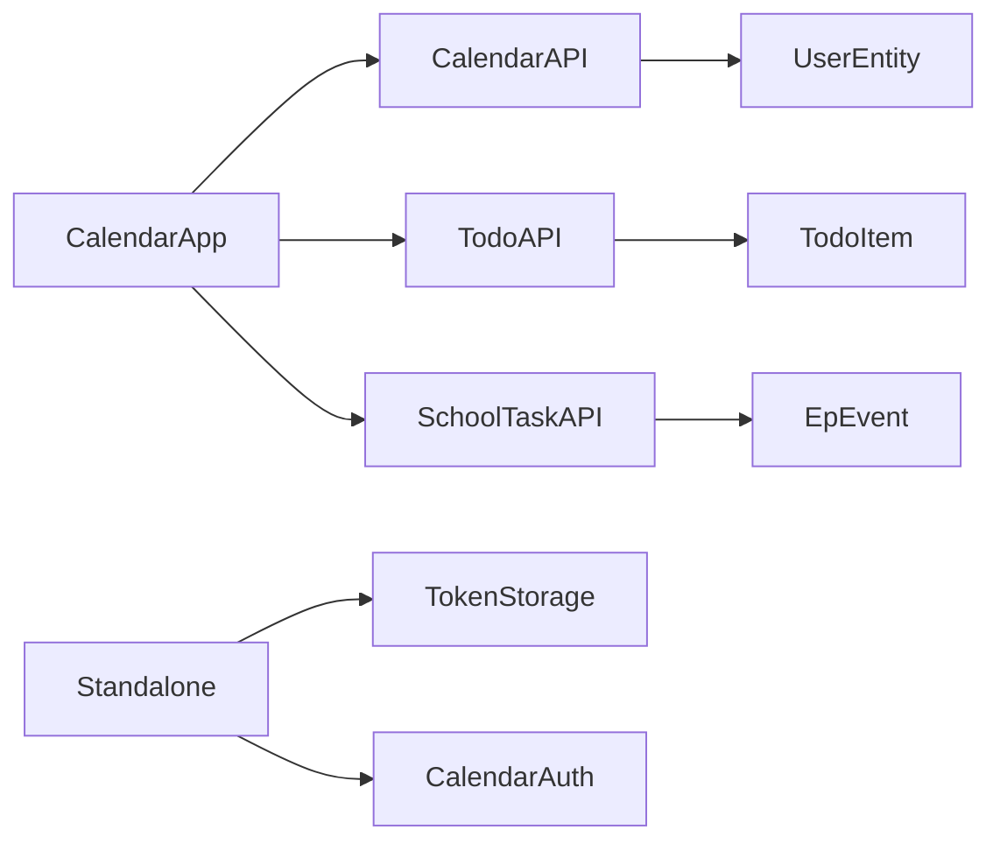

# XOS — План: приложение «Календарь»

> Версия: 2026-07-27  
> Цель: Google Calendar–подобный UI с собственными календарями, share, overlay Todo (due) и SchoolTask (уроки учителя), Desktop-окно + standalone `/calendar`.  
> Формат: `- [ ]` для трекинга оркестратором.

## Легенда

- **Зависимости:** номера этапов, которые должны быть завершены
- **Параллельность:** `[‖]` — можно выполнять параллельно с указанным этапом
- **Субагент:** рекомендуемый исполнитель

---

## Сводка

| | |
|---|---|
| **Продукт** | Приложение «Календарь» в XOS |
| **Клиент** | React 19 + Vite + Mantine 9 (`@mantine/schedule`) + TanStack Query + Zustand |
| **Сервер** | Symfony-модуль `Calendar` по образцу `Todo` (+ email-auth по образцу IncCom/SchoolTask) |
| **Точки входа** | Desktop-окно (`AppRegistry`) и SPA `/calendar` |
| **Не цель MVP** | Полный паритет Google (ресурсы, rooms, conference, сложные RRULE, импорт ICS) |

### Scope MVP (in)

1. Виды **день / неделя / месяц**, навигация по датам (сегодня, prev/next, выбор даты).
2. **Собственные календари**: несколько штук, заголовок + цвет, список слева с вкл/выкл.
3. **События** своих календарей: CRUD в видимом диапазоне.
4. Overlay **Todo**: пункты с `due_at` (только с датой).
5. Overlay **SchoolTask**: уроки teacher calendar (`/api/schooltask/calendar/teacher/events`).
6. **Share** календаря по email (read/write) — паттерн Todo.
7. Standalone **`/calendar`** с email-auth (realm `app`).

### Scope out (позже / по уточнению)

- Recurrence (RRULE), перетаскивание между днями как отдельный UX-полиш, ICS, уведомления, student class calendars SchoolTask, публичные ссылки без аккаунта.

---

## Ограничения и допущения

### Нельзя ломать

- Существующие API Todo (`/api/todo`) и SchoolTask (`/api/schooltask`) — только **расширять** (например, range-query для due items), не менять контракты списков/markdown.
- Dual auth: `tokenStorage` realms `desktop` | `app`; interceptors и refresh queue.
- Регистрация desktop-приложений через `apps/*/index.ts` + `registerApps` (`import.meta.glob`).
- UI: **Mantine** (не Ant Design); иконки Tabler / `react-icons` по проекту.

### Допущения (до ответов на открытые вопросы)

1. **Доступ к модулю Calendar** — как у Todo: любой авторизованный `ROLE_USER` / `ROLE_ROOT` (`canUseAuthenticatedApps`), без отдельного claimant в MVP. Standalone login — email + пароль, без жёсткой привязки к `ROLE_schooltask`.
2. Overlay SchoolTask показывается **только если** у пользователя есть права teacher events; иначе пункт в sidebar скрыт или disabled.
3. Overlay Todo: **один системный календарь «Заметки»** (все due-items доступных списков); цвет — нейтральный/фиксированный или от списка (уточнить).
4. Переключатели видимости календарей хранятся **на клиенте** (user_settings category `calendar` или localStorage) в MVP; серверная подписка — опционально позже.
5. Агрегация событий на **клиенте** (несколько запросов → единый `CalendarEventViewModel`); server-side feed — оптимизация после MVP.
6. Собственные события **входят в MVP** (иначе «несколько календарей» бессмысленны без контента).

### Паттерны встройки (изученный контекст)

| Слой | Ориентир |
|------|----------|
| Desktop app | `apps/todo/` — manifest, `singleInstance`, `wmGroup: 'tools'` |
| Standalone shell | `apps/schooltask-standalone/`, `apps/inccom/IncComStandaloneApp.tsx` |
| Path → realm | `resolveStandaloneApp()` / `resolveAuthRealm()` в `tokenStorage.ts` |
| App switch | `App.tsx` → `StandaloneShell` |
| Email firewalls | `security.yaml`: `app_login` / `schooltask_login` + refresh |
| Share UX/API | `TodoShareModal` + `TodoListShare` + `TodoManager::shareList` |
| Week UI | `@mantine/schedule` (`DayView` / `WeekView` / `MonthView` уже в пакете); SchoolTask `WeekCalendar` — **не копировать** 1:1 (там 6 дней без выходных) |
| Teacher lessons | `schooltaskCalendarApi.teacherEvents(range)` |
| Todo due | `TodoItem.due_at`, markdown `| due:…`; **нет** API «items in range» — нужно добавить |

---

## Архитектура данных (что проектировать Архитектору)

### Сущности (модуль `server/src/Calendar/`)

```
Calendar
  id, owner_id → User, title, color, created_at, updated_at

CalendarEvent
  id, calendar_id → Calendar
  title, description nullable
  start_at, end_at
  all_day bool
  (без recurrence в MVP)

CalendarShare
  id, calendar_id, user_id → User
  permission: read | write
  UNIQUE(calendar_id, user_id)
```

### Логические «источники» в UI (не обязательно таблицы)

| source | Тип | Данные |
|--------|-----|--------|
| `own:{calendarId}` | persisted | `CalendarEvent` |
| `shared:{calendarId}` | persisted + share | те же события, read/write по share |
| `overlay:todo` | virtual | Todo items с `due_at` in range |
| `overlay:schooltask` | virtual | teacher events in range |

### Клиентская модель события (view-model)

Единый тип для сетки (примерно):

- `uid` (стабильный ключ: `own-123`, `todo-45`, `st-78`)
- `source`, `calendarId?`, `title`, `start`, `end`, `allDay`, `color`, `editable`, `payload`

Маппинг Todo: `start = end = due_at` (или all-day на дату due); клик → просмотр / deeplink в Todo (MVP: read-only модалка).  
Маппинг SchoolTask: из `CalendarEvent` schooltask API; клик → переиспользовать `EventTeacherModal` или read-only деталь.

---

## API-контракт (черновик для Архитектора)

Базовый префикс: `/api/calendar`.

### Auth (standalone, зеркало SchoolTask/IncCom)

- `POST /api/calendar/auth/login` — email + password → JWT (email provider + user_checker)
- `POST /api/calendar/token/refresh`
- `POST /api/calendar/auth/logout`
- Access control: login/refresh PUBLIC; остальное `IS_AUTHENTICATED_FULLY`

Клиент: расширить `StandaloneAppId` = `'calendar'`, interceptors (refresh/logout paths), `App.tsx` lazy shell.

### Calendars

- `GET /api/calendar/calendars` — owned + shared (флаги `is_owner`, `can_write`, `owner`)
- `POST /api/calendar/calendars` — `{ title, color }`
- `GET|PUT|DELETE /api/calendar/calendars/{id}`
- `POST /api/calendar/calendars/{id}/share` — `{ email, permission }`
- `DELETE /api/calendar/calendars/{id}/share/{userId}`
- `GET /api/calendar/users/by-email?email=` — как Todo (или общий helper)

### Events

- `POST /api/calendar/events/query` — `{ start, end, calendar_ids?: number[] }` → события доступных календарей в диапазоне
- `POST /api/calendar/events` — create
- `PUT|DELETE /api/calendar/events/{id}`
- Права: owner calendar или share `write`

### Overlays (предпочтительно отдельные тонкие эндпоинты / расширения)

1. **Todo** (расширение модуля Todo, не дублировать markdown):  
   `GET|POST /api/todo/items/due?start&end` (или `/api/calendar/overlays/todo`) — items с `due_at` в диапазоне по спискам, где user owner/share. Поля: `id, list_id, list_title, list_color, text, done, due_at`.
2. **SchoolTask**: клиент вызывает уже существующий `POST /api/schooltask/calendar/teacher/events` с `{ start, end }`; отдельный proxy в Calendar **не обязателен**. При 403 — скрыть overlay.

### Регистрация сервера

- Doctrine mapping `Calendar\Entity`
- `services.yaml` Controllers/Repositories/Manager
- `routes.yaml` prefix `/api/calendar`
- `setting.json` + claimants — только если решим protected module (сейчас — нет)
- PHPUnit: CRUD, изоляция owner/share, range query, auth login

---

## Клиентские слои

```
client/src/core/api/endpoints/calendarApi.ts   # Zod + apiClient
client/src/core/api/queryKeys.ts               # queryKeys.calendar.*
client/src/features/calendar/
  calendarAccess.ts
  types.ts / mappers (todo, schooltask → view-model)
  store/uiStore.ts          # view, visibleIds, cursorDate (Zustand)
  components/
    CalendarShell.tsx       # sidebar + toolbar + main
    CalendarSidebar.tsx
    CalendarToolbar.tsx
    CalendarGrid.tsx        # DayView | WeekView | MonthView
    EventFormModal.tsx
    CalendarShareModal.tsx  # по TodoShareModal
  standalone/
    authApi.ts, ProtectedRoute.tsx, routes.tsx, calendar-standalone.tsx
client/src/apps/calendar/
  index.ts                  # AppManifest
  CalendarApp.tsx           # окно Desktop
  CalendarIcon (AppIcons)
client/src/apps/calendar-standalone/
  CalendarStandaloneApp.tsx # /calendar shell
```

Точки проводки:

- `tokenStorage.resolveStandaloneApp` → `'calendar'`
- `App.tsx` StandaloneShell
- `interceptors.ts` — calendar auth/refresh URLs + при необходимости realm для `/api/calendar/`
- `PROTECTED_APP_MODULES` — **не** добавлять, если доступ как у Todo

---

## UX

### Layout

- **Слева:** «Мои календари» (checkbox + цвет + название), «Другие календари» (shared), «Системные» (Заметки, Моё расписание).
- **Сверху:** Сегодня | ‹ › | заголовок периода | сегмент День/Неделя/Месяц | (опц.) создать.
- **Центр:** `@mantine/schedule` view; полная неделя (в отличие от SchoolTask WeekCalendar).
- **Клики:** слот → создать в выбранном/дефолтном own-календаре; событие → модалка по `source`.

### Share flow

Как Todo: email lookup → permission read/write → список shares → revoke. Shared calendar появляется у получателя в sidebar.

### Toggles

Вкл/выкл только влияет на merge в `CalendarGrid`; не удаляет данные. Персист: `user_settings` key `visible_calendars` (предпочтительно) или localStorage.

---

## Текущие риски / выводы

| Риск | Митигация |
|------|-----------|
| Нет Todo range API | Этап 3: добавить endpoint + индекс `due_at` уже есть |
| SchoolTask права / standalone JWT | Graceful degrade; проверить, что JWT после calendar-login проходит schooltask voters |
| Путаница WeekCalendar SchoolTask vs Calendar | Новый `CalendarGrid`, не расширять schooltask `WeekCalendar` под Google-UX |
| Dual-auth regressions | Тесты interceptors; не смешивать desktop/app tokens |
| Перезапись общего `docs/PLAN.md` | Этот файл — план Calendar; старый migration-план завершён (этапы 0–N done) |
| Scope creep Google parity | Жёсткий MVP; recurrence/ICS — out |
| Производительность месяца (много events) | Query строго по visible range + selected calendar_ids |

---

## План (инкременты)

### Этап 0. Уточнение ТЗ и контракт Архитектора (0.5 д)

**Зависимости:** нет  
**Субагент:** architect (+ ответы пользователя на вопросы ниже)

- [x] **0.1** Зафиксировать ответы на открытые вопросы (доступ, todo overlay granularity, own events в MVP, student vs teacher).
- [x] **0.2** Детализировать схему БД, OpenAPI/DTO, коды ошибок, миграции.
- [x] **0.3** Утвердить UX wireframe sidebar + views (без pixel-perfect).

**Проверка:** короткий ADR/секция в PLAN или ARCHITECTURE; чеклист полей API согласован.

---

### Этап 1. Backend: Calendar + Event + Share (2–3 д)

**Зависимости:** 0  
**Субагент:** developer

- [x] **1.1** Entity `Calendar`, `CalendarEvent`, `CalendarShare` + migration.
- [x] **1.2** `CalendarManager` (доступ owner/share, сериализация как Todo).
- [x] **1.3** Controllers CRUD calendars / events / share / by-email.
- [x] **1.4** PHPUnit: изоляция, share read/write, range query.
- [x] **1.5** Подключить doctrine/services/routes.

**Проверка:** PHPUnit green; ручной smoke через API (create calendar → event → share → second user sees).

---

### Этап 2. Backend auth standalone + Todo due-range (1–1.5 д) `[‖ часть 1]`

**Зависимости:** 0; due-range можно параллельно с 1  
**Субагент:** developer

- [x] **2.1** Firewalls `calendar_login` / `calendar_refresh` + logout + access_control (копия schooltask pattern).
- [x] **2.2** User checker: аутентифицированный пользователь с email (уточнить минимальные роли).
- [x] **2.3** Todo: endpoint items by `due_at` range + PHPUnit.
- [x] **2.4** (Опц.) добавить `calendar` в docs API_SPEC.

**Проверка:** login по email на `/api/calendar/auth/login`; due-range возвращает только доступные lists.

---

### Этап 3. Клиент: Desktop shell + own calendars/events (2–3 д)

**Зависимости:** 1  
**Субагент:** developer

- [x] **3.1** `calendarApi` + `queryKeys.calendar`.
- [x] **3.2** `apps/calendar` manifest + `CalendarApp` + icon.
- [x] **3.3** Sidebar (own calendars CRUD title/color, toggles) + toolbar views.
- [x] **3.4** `CalendarGrid` на Day/Week/Month (`@mantine/schedule`).
- [x] **3.5** EventFormModal create/edit/delete; ShareModal.

**Проверка:** окно из Start Menu; создать 2 календаря разных цветов; события видны в трёх views; toggle скрывает; share между двумя users.

---

### Этап 4. Overlays Todo + SchoolTask (1–2 д)

**Зависимости:** 2.3, 3  
**Субагент:** developer

- [x] **4.1** Mapper + query Todo due → view-model; системный checkbox «Заметки».
- [x] **4.2** Mapper teacher events; checkbox «Моё расписание»; hide without access.
- [x] **4.3** Модалки клика overlay (read-only / teacher modal).
- [x] **4.4** Юнит-тесты mappers; ручной smoke с due_at и уроками.

**Проверка:** due-задача появляется в дне; урок учителя — в неделе; выключение overlay убирает события.

---

### Этап 5. Standalone `/calendar` (1–1.5 д)

**Зависимости:** 2.1–2.2, 3  
**Субагент:** developer

- [x] **5.1** `apps/calendar-standalone` + routes + ProtectedRoute + sign-in page (упрощённо как schooltask).
- [x] **5.2** `tokenStorage` + `App.tsx` + interceptors.
- [x] **5.3** Hydrate realm `app`; settings bootstrap по аналогии SchooltaskStandaloneApp.
- [ ] **5.4** Проверить overlays под app-token (todo + schooltask).

**Проверка:** `/calendar` без desktop-сессии → login → тот же UI; logout чистит app tokens; desktop `/` не затронут.

---

### Этап 6. Полировка, доступы, документация (1 д)

**Зависимости:** 4, 5  
**Субагент:** developer / tech-writer / tester

- [x] **6.1** Персист visible calendars (settings).
- [x] **6.2** Empty states, ошибки, loading overlays.
- [ ] **6.3** E2E/smoke checklist (desktop + standalone).
- [x] **6.4** Обновить DEVELOPER_GUIDE / API_SPEC краткой секцией Calendar.
- [ ] **6.5** Регрессия SchoolTask WeekCalendar и Todo share (не сломаны).

**Проверка:** чеклист тестера; lint/typecheck; PHPUnit + ключевые client tests.

---

## Зависимости от существующих модулей



- **Todo** — due overlay + UX share как шаблон.
- **SchoolTask** — только teacher events API + опционально UI модалки.
- **Auth/tokenStorage/App.tsx** — третий standalone path.
- **@mantine/schedule** — уже в `package.json` (^9.4.1).
- **user_settings** — персист UI (этап 6).

---

## Следующие шаги

### Архитектор

1. Утвердить ERD + миграции `calendar`, `calendar_event`, `calendar_share`.
2. Специфицировать JSON request/response (Zod на клиенте / валидаторы на сервере).
3. Решить: Todo due endpoint в модуле Todo vs `/api/calendar/overlays/*`.
4. Спроектировать calendar email user_checker (роли).
5. Не смешивать домен SchoolTask WeekCalendar с новым CalendarGrid.

### Оркестратор

1. После 0.x — нарезать задачи разработчику по этапам 1→6.
2. На каждом этапе требовать проверки из секции «Проверка».
3. Не начинать этап 5 до рабочих firewalls (2.1) и desktop UI (3).

### Тестер

- Матрица: owner / shared read / shared write / overlay todo / overlay schooltask denied / standalone login.

---

## Открытые вопросы (нужны ответы до/на этапе 0)

1. **Own events в MVP** — подтвердить (план исходит из «да»).
2. **Todo overlay** — один календарь «Заметки» или отдельный checkbox на каждый Todo-list (цвет списка)?
3. **SchoolTask** — только teacher «Моё расписание», или ещё student class calendars?
4. **Доступ** — как Todo (все USER) или protected module `ROLE_calendar` + claimant?
5. **Standalone auth** — отдельный firewall `/api/calendar/auth/*` (как в плане) или вход только через desktop без email SPA-login?
6. **Клик по Todo/уроку** — только просмотр в Calendar или deep-link/открытие окна Todo / SchoolTask?
7. **All-day / длительность Todo** — due как точка во времени или all-day на дату?
8. **Дефолтный календарь** при первом входе — автосоздание «Личный»?
