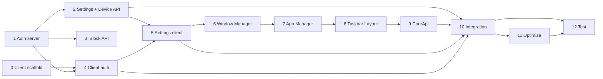

# XOS — План реализации

> Версия: 2026-07-14  
> Оценка: **~27 рабочих дней** (1 разработчик full-stack + точечная помощь)  
> Формат: `- [ ]` для трекинга оркестратором

## Легенда

- **Зависимости:** номера этапов, которые должны быть завершены
- **Параллельность:** `[‖]` — можно выполнять параллельно с указанным этапом
- **Субагент:** рекомендуемый исполнитель

---

## Этап 0. Подготовка клиента (2 дня)

**Зависимости:** нет  
**Субагент:** developer

- [x] **0.1** Обновить `client/package.json` до версий из ARCHITECTURE.md §6.1
- [x] **0.2** Удалить legacy-зависимости (react-draggable, react-resizable, @dnd-kit, tiptap, recharts и т.д.)
- [x] **0.3** Настроить `tsconfig.json` (strict, paths `@/*`)
- [x] **0.4** Настроить `vite.config.ts` (Tailwind 4 plugin, proxy, manualChunks)
- [x] **0.5** Настроить ESLint 9 flat config + Prettier
- [x] **0.6** Создать каркас директорий `src/core/*`, `src/apps/`, `src/types/`, `src/styles/`
- [x] **0.7** `main.tsx` + `App.tsx` (MantineProvider, QueryClientProvider, условный Login/Desktop)
- [x] **0.8** Tailwind globals + Mantine theme (`styles/theme.ts`)
- [x] **0.9** `.env.example`: `VITE_API_URL`, `VITE_USE_API_SETTINGS=false`

---

## Этап 1. Сервер: Auth & Account доработка (3 дня)

**Зависимости:** нет `[‖ 0]`  
**Субагент:** developer

- [x] **1.1** LoginSuccessHandler: ответ `{ token, refresh_token, user: { id, login, email, roles, scopes } }`
- [x] **1.2** Активировать logout в `security.yaml` + `LogoutHandler` (инвалидация refresh)
- [x] **1.3** Расширить GET `/api/user` (login, alias, scopes)
- [x] **1.4** Удалить/закрыть заглушки в `ApiLoginController` (refresh-token stub)
- [x] **1.5** PHPUnit: login, refresh, login-check, logout
- [x] **1.6** Проверить CORS для `localhost:5173`

---

## Этап 2. Сервер: Settings API + Device prefix (3 дня)

**Зависимости:** 1  
**Субагент:** developer

- [x] **2.1** Entity `UserSetting` + Repository + Migration (`user_settings`)
- [x] **2.2** `ApiSettingsController`: GET all, GET one, POST upsert/batch, DELETE
- [x] **2.3** Валидация category enum + key length + JSON value
- [x] **2.4** PHPUnit: settings CRUD, изоляция по user_id
- [x] **2.5** Перенести Device routes на `/api/device/*` (alias `/device/*` → redirect/deprecated)
- [x] **2.6** Обновить `security.yaml`: firewall покрывает `/api/device`

---

## Этап 3. Сервер: IBlock API (2 дня) `[‖ 2]`

**Зависимости:** 1  
**Субагент:** developer

- [x] **3.1** Унифицировать namespace IBlock entities → `IBlock\Entity`
- [x] **3.2** CRUD controllers: block, element, section, property, type
- [x] **3.3** POST `/list` паттерн для element
- [x] **3.4** Миграции (если `#[ORM\Entity]` добавлен)

---

## Этап 4. Клиент: API layer + Auth (2 дня)

**Зависимости:** 0, 1  
**Субагент:** developer

- [x] **4.1** `core/api/client.ts` — Axios instance, baseURL
- [x] **4.2** `interceptors.ts` — Bearer, 401 refresh queue, 403/500 toasts
- [x] **4.3** `endpoints/auth.ts`, `account.ts` — typed + Zod schemas
- [x] **4.4** `authStore.ts` — login, logout, hydrate, token persistence
- [x] **4.5** `coreRoles.ts`, `coreScopes.ts` — isRole, isAdmin, checkHasScope, getLevelScope
- [x] **4.6** `LoginScreen.tsx` — Mantine Form + Zod (username/password)
- [x] **4.7** TanStack Query: `queryKeys.auth`, useUser, useAccesses

---

## Этап 5. Клиент: SettingManager (2 дня)

**Зависимости:** 0, 4 `[‖ 2 для ApiAdapter]`  
**Субагент:** developer

- [x] **5.1** `ISettingAdapter`, `LocalStorageAdapter`
- [x] **5.2** `Setting`, `Config`, `SettingManager` (get/set/has/remove/sub, priority)
- [x] **5.3** `config/defaults.ts` — HKEY_CONFIG defaults (layout, window)
- [x] **5.4** `hooks.ts` — useSetting, useSetState (debounced persist)
- [x] **5.5** `ApiAdapter` — GET/POST `/api/settings` (после этапа 2)
- [x] **5.6** `CompositeAdapter` — local + api, fallback on error
- [x] **5.7** Unit tests: priority resolution, adapter fallback

---

## Этап 6. Клиент: Window Manager (3 дня)

**Зависимости:** 5  
**Субагент:** developer / react-specialist

- [x] **6.1** `useWmStore.ts` — windows map, zIndex, activeWindow
- [x] **6.2** `Window.tsx` — react-rnd, titlebar, controls (min/max/close)
- [x] **6.3** Mobile <768px: fullscreen minus taskbar
- [x] **6.4** `WindowApi.ts` — close (onClose cancel), minimize, maximize, restore, refresh, setTitle
- [x] **6.5** Auto-persist WIN settings (debounce 300ms)
- [x] **6.6** Restore windows on load from settings
- [x] **6.7** `WindowErrorBoundary.tsx`
- [x] **6.8** `useWindowSize.ts` + window: Tailwind breakpoints

---

## Этап 7. Клиент: App Manager (2 дня)

**Зависимости:** 6  
**Субагент:** developer

- [x] **7.1** `AppManifest` type, `AppRegistry.ts`
- [x] **7.2** `registerApps.ts` — `import.meta.glob('../apps/*/index.ts')`
- [x] **7.3** `useAppManager.ts` — launchApp, singleInstance, focus existing
- [x] **7.4** `launchHistory.ts` — localStorage APP category, restore on startup
- [x] **7.5** Role/scope gate перед launch
- [x] **7.6** Demo app `apps/demo-calculator/index.ts`

---

## Этап 8. Клиент: Taskbar + Layout + Desktop (3 дня)

**Зависимости:** 7  
**Субагент:** react-specialist

- [x] **8.1** `parseView.ts` — парсер `"hhh lmr ffr"` → CSS Grid areas
- [x] **8.2** `Layout.tsx`, `LayoutArea.tsx`, `ResizablePanel.tsx` — drag resize, collapse <50px
- [x] **8.3** Persist panel widths (USER settings)
- [x] **8.4** `mobileView` support (<768px)
- [x] **8.5** `Taskbar.tsx` — height constant, position bottom
- [x] **8.6** `StartMenu.tsx` — filtered app list
- [x] **8.7** `RunningApps.tsx` — wmGroup grouping, dropdown, group minimize/restore
- [x] **8.8** `Desktop.tsx` — WM container + Layout integration

---

## Этап 9. Клиент: CoreApi + Child Windows (2 дня)

**Зависимости:** 8  
**Субагент:** developer

- [x] **9.1** `createCoreApi.ts` — factory per window instance
- [x] **9.2** `CoreApiContext.tsx`, `AppContext.tsx`
- [x] **9.3** `useCoreApi.ts`, `useApp.ts`
- [x] **9.4** `ChildWindowPortal.tsx` + `createChildWindow` (no taskbar registration)
- [x] **9.5** Window events: onClose, onFocus, onResize (on/off)

---

## Этап 10. Интеграция клиент ↔ сервер (2 дня)

**Зависимости:** 2, 4, 5, 9  
**Субагент:** developer

- [x] **10.1** End-to-end auth flow (login → desktop → refresh → logout)
- [x] **10.2** ApiAdapter включение через `VITE_USE_API_SETTINGS=true`
- [x] **10.3** Preload settings on startup
- [x] **10.4** `apps/users` — список пользователей (Main API)
- [x] **10.5** `apps/settings` — профиль (GET/PUT account)
- [x] **10.6** Error handling polish (network offline toast)

---

## Этап 11. Оптимизация (2 дня)

**Зависимости:** 10  
**Субагент:** react-specialist

- [x] **11.1** `VirtualTable.tsx` — react-window для списков >100
- [x] **11.2** React.memo / useCallback audit для Window
- [x] **11.3** Bundle analysis — target <200KB gzip core chunk
- [x] **11.4** Lazy load apps + modals
- [x] **11.5** Lighthouse / performance check (drag 60fps)

---

## Этап 12. Тестирование и документация (3 дня)

**Зависимости:** 10, 11  
**Субагент:** tester + tech-writer

- [x] **12.1** PHPUnit: coverage auth, settings, main user list
- [x] **12.2** Vitest: SettingManager, parseView, coreRoles/scopes
- [x] **12.3** E2E smoke (Playwright): login → open app → move window → reload → restore
- [x] **12.4** README: запуск server + client
- [x] **12.5** Developer guide: «Как создать app в apps/»

---

## Сводка по срокам

| Этап | Название | Дни |
|------|----------|-----|
| 0 | Подготовка клиента | 2 |
| 1 | Auth & Account | 3 |
| 2 | Settings API + Device prefix | 3 |
| 3 | IBlock API | 2 |
| 4 | Client API + Auth | 2 |
| 5 | SettingManager | 2 |
| 6 | Window Manager | 3 |
| 7 | App Manager | 2 |
| 8 | Taskbar + Layout | 3 |
| 9 | CoreApi + Child Windows | 2 |
| 10 | Интеграция | 2 |
| 11 | Оптимизация | 2 |
| 12 | Тестирование + docs | 3 |
| **Итого** | | **27** |

---

## Граф зависимостей

---

## Параллельные треки (2 разработчика)

| Dev A (Backend) | Dev B (Frontend) |
|-----------------|------------------|
| Этап 1 (дни 1–3) | Этап 0 (дни 1–2) → Этап 4 (дни 3–4) |
| Этап 2 (дни 4–6) | Этап 5 (дни 5–6) → Этап 6 (дни 7–9) |
| Этап 3 (дни 7–8) | Этап 7–8 (дни 10–14) |
| Support integration | Этап 9–11 (дни 15–20) |
| PHPUnit | Этап 10–12 (дни 21–27) |

---

## Рекомендуемый порядок для оркестратора

1. **developer** → Этап 0 (client scaffold)
2. **developer** → Этап 1 (auth server) `[‖]` Этап 4 после 0.7
3. **developer** → Этап 2 (settings API)
4. **developer** → Этап 5 + 6 (settings + WM)
5. **react-specialist** → Этап 8 (taskbar/layout)
6. **developer** → Этап 7, 9, 10
7. **tester** → Этап 12
