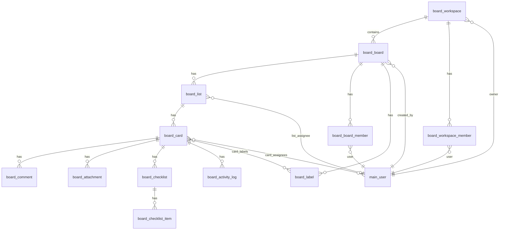

# План разработки приложения «Доска» (Kanban)

> Версия: 1.0 · Дата: 2026-08-17  
> Репозиторий: XOS monorepo (`server/` Symfony 7, `client/` React 19 + Mantine)  
> Статус: **готов к передаче Архитектору**

---

## 1. Executive summary

### Цель

Kanban-приложение «Доска» для визуального планирования задач внутри desktop-shell XOS: workspaces → boards → lists → cards, с коллаборацией, правами и Trello-like UX.

### MVP (фаза 1–4, ~8–12 недель)

| В scope MVP | Out of scope MVP (v2+) |
|-------------|------------------------|
| Модуль Symfony `Board`, REST `/api/board/*` | GraphQL |
| Регистрация app `board` + `ProtectedAppModules` | Unsplash / внешние фоны |
| CRUD workspace / board / list / card | Real-time (Mercure/WebSocket) |
| DnD lists & cards (`@dnd-kit`) | Mobile polish (touch gestures) |
| Роли workspace/board: owner, admin, editor, observer | Email-уведомления при invite |
| Invite по email (как Todo share) | Offline mode |
| Card: title, description (Markdown), due date, labels, checklist | Advanced automation (rules) |
| Comments, attachments (через `UploadPathResolver`) | Global search across all workspaces |
| Activity log (append-only) | Board templates |
| Board filters: assignees, labels, due dates | List WIP limits |
| Dashboard: workspaces + boards | Public guest links без auth |
| Light/dark theme (наследуется от shell) | Import/export Trello JSON |

### v2 (фаза 5+)

- Polling/long-poll или Mercure для live-updates
- Глобальный поиск с индексом
- Unsplash API для обложек
- Batch reorder API, optimistic concurrency (`version` column)
- Admin UI bulk operations

---

## 2. Архитектурные решения

### 2.1. Модуль Symfony `Board`

**Образец:** `server/src/Todo/` (простой CRUD + share), `server/src/Calendar/` (sharing), `server/src/IncCom/` (сложный домен).

```
server/src/Board/
├── config/
│   ├── routes.yaml          # import Controllers (как Todo)
│   ├── services.yaml        # autowire Controller/Repository/Service
│   └── packages/
│       ├── doctrine.yaml    # mapping Board\Entity
│       └── security.yaml    # firewall ^/api/board (JWT, как другие)
├── Controller/              # attribute routes #[Route('/api/board/...')]
├── Entity/
├── Repository/
├── Service/
│   ├── BoardManager.php     # extends AbstractManager (как TodoManager)
│   ├── PermissionResolver.php
│   └── ActivityLogger.php
├── Security/Voter/          # BoardVoter, CardVoter
├── Enum/
│   ├── MemberRole.php
│   └── ActivityAction.php
└── setting.json             # claimants + map-access
```

**Автоподключение (уже работает в проекте):**

- Routes: `App\Kernel::configureRoutes()` → `src/*/config/routes.yaml` ([`server/src/App/Kernel.php`](../../server/src/App/Kernel.php))
- Services: [`server/config/services.yaml`](../../server/config/services.yaml) → `imports: ../src/*/config/services.yaml`
- Doctrine: [`server/config/packages/doctrine.yaml`](../../server/config/packages/doctrine.yaml) → `src/*/config/packages/doctrine.yaml`

**Deploy:** после миграций — `php bin/console main:claimant:sync` ([`server/update`](../../server/update), [`docs/MIGRATIONS.md`](../MIGRATIONS.md)).

### 2.2. REST API

- Prefix: **`/api/board`**
- Auth: JWT (`IS_AUTHENTICATED_FULLY`), как Todo ([`TodoListController`](../../server/src/Todo/Controller/TodoListController.php))
- Модульный gate: `#[Access('board')]` + granular `can_*` на контроллерах (как Device)
- Доменные права (owner/admin/editor/observer, list assignee, card assignee) — в **Service + Voter**, не через claimant bitmask
- Формат ошибок: `{ message, violations }` ([`docs/ARCHITECTURE.md`](../ARCHITECTURE.md))
- Пагинация legacy там, где списки большие: `Content-Range` ([`App\Http\ContentRangeHeaders`](../../server/src/App/Http/ContentRangeHeaders.php))

**Не GraphQL** — единообразие с остальными модулями XOS.

### 2.3. Интеграция с apps registry (клиент)

| Шаг | Файл / механизм |
|-----|-----------------|
| Манифест app | `client/src/apps/board/index.ts` — auto-discovery через [`registerApps.ts`](../../client/src/core/appManager/registerApps.ts) (`import.meta.glob('../../apps/*/index.ts')`) |
| Gate доступа | `canAccess: () => canUseBoard()` → `canUseAppModule('board')` ([`protectedApps.ts`](../../client/src/core/auth/protectedApps.ts)) |
| API client | `client/src/core/api/endpoints/boardApi.ts` (Zod + axios, образец [`todoApi.ts`](../../client/src/core/api/endpoints/todoApi.ts)) |
| Query keys | `client/src/core/api/queryKeys.ts` — секция `board` |
| Feature UI | `client/src/features/board/` |
| UI prefs (фильтры, last board) | `user_app_data` codes: `board.ui.filters`, `board.ui.lastBoardId` ([ADR](../ADR-user-app-data.md)) |

### 2.4. Включение приложения пользователю (ТЗ п. 3.1)

Добавить **`board`** в protected modules (синхронно BE + FE):

- [`server/src/App/Security/ProtectedAppModules.php`](../../server/src/App/Security/ProtectedAppModules.php) — `'board'`
- [`client/src/core/auth/protectedApps.ts`](../../client/src/core/auth/protectedApps.ts) — `'board'`
- [`server/src/Board/setting.json`](../../server/src/Board/setting.json):

```json
{
  "name": "Board",
  "claimant": { "board": "Доска" },
  "map-access": {
    "can_read": { "bit": 1, "title": "Чтение" },
    "can_write": { "bit": 2, "title": "Запись" }
  }
}
```

После sync — вкладка «Доступ к приложениям» в Main Admin ([`docs/DEVELOPER_GUIDE.md`](../DEVELOPER_GUIDE.md) § Claimants).

**Семантика:**

- `can_read` / `can_write` (claimant) = **может ли пользователь вообще открыть app Board**
- Роли workspace/board/list/card = **внутри app**, отдельные таблицы membership

### 2.5. Real-time (MVP vs v2)

В проекте **нет** Mercure/WebSocket.

| MVP | v2 |
|-----|-----|
| Optimistic UI + `PUT /cards/{id}/move` | Mercure hub или polling `GET /boards/{id}/changes?since=` |
| React Query `invalidateQueries` после mutation | Presence indicators |
| Manual refresh кнопка на board | Conflict resolution UI |

**MVP достаточен** для single-user и малых команд; latency DnD <100ms достигается client-side optimistic update без ожидания сети.

### 2.6. Вложения

- Расширить [`UploadPathResolver::ALLOWED_MODULES`](../../server/src/Main/Service/UploadPathResolver.php): добавить `'board'`
- Хранить `file_url` / relative path в `board_attachment`
- Upload endpoint: `POST /api/board/cards/{id}/attachments` (multipart), по аналогии с Device uploads

### 2.7. DnD библиотека (frontend)

**Рекомендация: `@dnd-kit/core` + `@dnd-kit/sortable`**

- React 19 compatible, accessibility, keyboard DnD
- В проекте DnD пока нет ([`client/package.json`](../../client/package.json))
- IncCom table DnD — custom MIME ([`column-dnd.ts`](../../client/src/features/inccom/shared/ui/table/utils/column-dnd.ts)), не подходит для Kanban

---

## 3. ER-модель (полная)

Префикс таблиц: **`board_`**. PK — `INT AUTO_INCREMENT`. Timestamps — `created_at`, `updated_at` (immutable datetime) где уместно.

### 3.1. Диаграмма связей



### 3.2. Таблицы

#### `board_workspace`

| Column | Type | Notes |
|--------|------|-------|
| id | INT PK | |
| name | VARCHAR(255) NOT NULL | |
| description | TEXT NULL | |
| owner_id | INT FK → main_user ON DELETE RESTRICT | |
| created_at | DATETIME | |
| updated_at | DATETIME | |

**Indexes:** `IDX_board_workspace_owner (owner_id)`

#### `board_workspace_member`

| Column | Type | Notes |
|--------|------|-------|
| id | INT PK | |
| workspace_id | INT FK → board_workspace CASCADE | |
| user_id | INT FK → main_user CASCADE | |
| role | VARCHAR(16) | `admin` \| `editor` \| `observer` |
| invited_by_id | INT FK → main_user SET NULL | nullable |
| created_at | DATETIME | |

**Unique:** `(workspace_id, user_id)`  
**Indexes:** `IDX_bwm_user (user_id)`

> Owner workspace **не дублируется** в member; права owner выводятся из `owner_id`.

#### `board_board`

| Column | Type | Notes |
|--------|------|-------|
| id | INT PK | |
| workspace_id | INT FK → board_workspace CASCADE | |
| title | VARCHAR(255) NOT NULL | |
| description | TEXT NULL | |
| background_type | VARCHAR(16) | `color` \| `image` \| `gradient` |
| background_value | VARCHAR(512) | hex / url / json |
| visibility | VARCHAR(16) | `private` \| `workspace` |
| created_by_id | INT FK → main_user SET NULL | |
| created_at | DATETIME | |
| updated_at | DATETIME | |

**Indexes:** `IDX_board_board_ws (workspace_id)`, `IDX_board_board_updated (updated_at)`

#### `board_board_member`

| Column | Type | Notes |
|--------|------|-------|
| id | INT PK | |
| board_id | INT FK → board_board CASCADE | |
| user_id | INT FK → main_user CASCADE | |
| role | VARCHAR(16) | `admin` \| `editor` \| `observer` |
| created_at | DATETIME | |

**Unique:** `(board_id, user_id)`  
**Indexes:** `IDX_bbm_user (user_id)`

> Для private board доступ только через board_member (+ workspace owner/admin).  
> Для `visibility=workspace` — все workspace members с editor+ видят board.

#### `board_list`

| Column | Type | Notes |
|--------|------|-------|
| id | INT PK | |
| board_id | INT FK → board_board CASCADE | |
| title | VARCHAR(255) NOT NULL | |
| order_index | INT NOT NULL | 0-based, gap strategy (×1024) |
| assignee_id | INT FK → main_user SET NULL | list assignee (ТЗ п. 3.4) |
| archived_at | DATETIME NULL | soft archive |
| created_at | DATETIME | |
| updated_at | DATETIME | |

**Indexes:** `IDX_board_list_board_order (board_id, order_index)`, `IDX_board_list_assignee (assignee_id)`

Entity PHP: `Board\Entity\BoardList` (избежать конфликта с `List`).

#### `board_card`

| Column | Type | Notes |
|--------|------|-------|
| id | INT PK | |
| list_id | INT FK → board_list CASCADE | |
| title | VARCHAR(512) NOT NULL | |
| description_md | TEXT NULL | Markdown |
| due_date | DATETIME NULL | |
| position | INT NOT NULL | порядок в list |
| cover_color | VARCHAR(16) NULL | |
| archived_at | DATETIME NULL | |
| created_by_id | INT FK → main_user SET NULL | |
| created_at | DATETIME | |
| updated_at | DATETIME | |

**Indexes:** `IDX_board_card_list_pos (list_id, position)`, `IDX_board_card_due (due_date)`, `IDX_board_card_title (title(191))` — prefix index для search MVP

#### `board_label`

| Column | Type | Notes |
|--------|------|-------|
| id | INT PK | |
| board_id | INT FK → board_board CASCADE | labels scoped to board |
| name | VARCHAR(64) NOT NULL | |
| color | VARCHAR(16) NOT NULL | hex |

**Unique:** `(board_id, name)`  
**Indexes:** `IDX_board_label_board (board_id)`

#### `board_card_label`

| card_id | INT FK CASCADE |
| label_id | INT FK CASCADE |

**PK:** `(card_id, label_id)`

#### `board_card_assignee`

| card_id | INT FK CASCADE |
| user_id | INT FK → main_user CASCADE |

**PK:** `(card_id, user_id)`  
**Index:** `IDX_bca_user (user_id)` — для фильтра assignees

#### `board_checklist`

| Column | Type | Notes |
|--------|------|-------|
| id | INT PK | |
| card_id | INT FK CASCADE | |
| title | VARCHAR(255) | |
| position | INT | |

#### `board_checklist_item`

| Column | Type | Notes |
|--------|------|-------|
| id | INT PK | |
| checklist_id | INT FK CASCADE | |
| text | VARCHAR(512) | |
| checked | TINYINT(1) | |
| position | INT | |

#### `board_attachment`

| Column | Type | Notes |
|--------|------|-------|
| id | INT PK | |
| card_id | INT FK CASCADE | |
| file_name | VARCHAR(255) | |
| file_url | VARCHAR(512) | relative path under uploads/board/ |
| mime_type | VARCHAR(128) NULL | |
| size_bytes | INT NULL | |
| uploaded_by_id | INT FK → main_user SET NULL | |
| created_at | DATETIME | |

**Index:** `IDX_board_attachment_card (card_id)`

#### `board_comment`

| Column | Type | Notes |
|--------|------|-------|
| id | INT PK | |
| card_id | INT FK CASCADE | |
| user_id | INT FK → main_user CASCADE | |
| text | TEXT NOT NULL | plain or markdown |
| created_at | DATETIME | |
| updated_at | DATETIME NULL | edited |

**Index:** `IDX_board_comment_card_created (card_id, created_at)`

#### `board_activity_log`

| Column | Type | Notes |
|--------|------|-------|
| id | INT PK | |
| board_id | INT FK → board_board CASCADE | denorm for board-level feed |
| card_id | INT FK → board_card SET NULL | |
| user_id | INT FK → main_user SET NULL | |
| action_type | VARCHAR(32) | см. enum ниже |
| details | JSON | `{ "field", "old", "new", "list_id", ... }` |
| created_at | DATETIME | |

**Indexes:** `IDX_board_activity_card (card_id, created_at)`, `IDX_board_activity_board (board_id, created_at)`

**action_type enum (MVP):** `card_created`, `card_moved`, `card_updated`, `comment_added`, `member_added`, `list_created`, `checklist_item_checked`, …

### 3.3. Сущности вне `board_*`

- `main_user` — существующая ([`Main\Entity\User`](../../server/src/Main/Entity/User.php))
- Invite by email → resolve через `UserRepository` (как [`TodoManager::findUserByEmail`](../../server/src/Todo/Service/TodoManager.php))

---

## 4. Матрица прав доступа

### 4.1. Унификация ролей (разрешение противоречия ТЗ)

| ТЗ (п. 3.4) | ТЗ (п. 6 BoardMember) | **Решение XOS** |
|-------------|------------------------|-----------------|
| Owner | — | `owner_id` на workspace/board (не в enum member) |
| Admin | admin | `admin` |
| Editor | member | `editor` |
| Observer | viewer | `observer` |

Enum: **`MemberRole: admin | editor | observer`**. Owner — производная роль.

### 4.2. Иерархия разрешений

Effective role на board = max( workspace_member_role, board_member_role, is_owner ) по шкале:

`observer(0) < editor(1) < admin(2) < owner(3)`

### 4.3. Матрица: Workspace

| Операция | owner | admin | editor | observer |
|----------|:-----:|:-----:|:------:|:--------:|
| Просмотр workspace | ✓ | ✓ | ✓ | ✓ |
| Редактировать name/description | ✓ | ✓ | — | — |
| Удалить workspace | ✓ | — | — | — |
| Создать board | ✓ | ✓ | ✓ | — |
| Пригласить member | ✓ | ✓ | — | — |
| Изменить role member | ✓ | ✓ | — | — |
| Удалить member | ✓ | ✓ | — | — |

### 4.4. Матрица: Board

| Операция | owner | admin | editor | observer |
|----------|:-----:|:-----:|:------:|:--------:|
| Просмотр board | ✓ | ✓ | ✓ | ✓ |
| Редактировать title/background/visibility | ✓ | ✓ | — | — |
| Удалить board | ✓ | ✓ | — | — |
| Управлять board members | ✓ | ✓ | — | — |
| CRUD labels | ✓ | ✓ | ✓ | — |
| CRUD lists | ✓ | ✓ | ✓* | — |
| CRUD cards | ✓ | ✓ | ✓* | — |
| Комментарии | ✓ | ✓ | ✓ | — |
| Attachments | ✓ | ✓ | ✓* | — |

\* **List assignee** (если `board_list.assignee_id = current_user`): полный CRUD cards **в этом list** + reorder list, даже если роль observer (ТЗ п. 3.4).

### 4.5. Матрица: Card (дополнительные правила)

| Операция | Кто может |
|----------|-----------|
| Редактировать card | board editor+, **или** card assignee, **или** list assignee, **или** board admin+ |
| Переместить card | те же + observer **не может** |
| Удалить card | board editor+ или list assignee или admin+ |
| Assign/unassign self | editor+ |
| Assign others | admin+ или list assignee |

### 4.6. Claimant scope (модуль Board)

| Scope | Назначение |
|-------|------------|
| `board` + `can_read` | Открыть приложение, read-only API fallback |
| `board` + `can_write` | Создавать workspace (первый owner = self) |

Детальные ACL — через membership tables, не bitmask.

---

## 5. API endpoints

Prefix: **`/api/board`**. Все endpoints требуют JWT.

### 5.1. Workspaces

| Method | Path | Описание |
|--------|------|----------|
| GET | `/workspaces` | Список доступных workspace |
| POST | `/workspaces` | Создать workspace |
| GET | `/workspaces/{id}` | Detail + boards summary |
| PUT | `/workspaces/{id}` | Update name/description |
| DELETE | `/workspaces/{id}` | Delete (owner only) |
| GET | `/workspaces/{id}/members` | List members |
| POST | `/workspaces/{id}/members` | Invite `{ email, role }` |
| PUT | `/workspaces/{id}/members/{userId}` | Change role |
| DELETE | `/workspaces/{id}/members/{userId}` | Remove member |

### 5.2. Boards

| Method | Path | Описание |
|--------|------|----------|
| GET | `/boards/{id}` | Full board payload (lists + cards + labels) — **основной экран** |
| POST | `/workspaces/{wsId}/boards` | Create board |
| PUT | `/boards/{id}` | Update meta/background/visibility |
| DELETE | `/boards/{id}` | Delete board |
| GET | `/boards/{id}/members` | Board members |
| POST | `/boards/{id}/members` | Add member |
| PUT | `/boards/{id}/members/{userId}` | Change role |
| DELETE | `/boards/{id}/members/{userId}` | Remove |
| GET | `/boards/{id}/activity` | Activity feed (paginated) |

### 5.3. Lists

| Method | Path | Описание |
|--------|------|----------|
| POST | `/boards/{id}/lists` | Create `{ title }` |
| PUT | `/lists/{id}` | Update title / assignee |
| DELETE | `/lists/{id}` | Delete (cards cascade or move — **Architect decision**) |
| PUT | `/boards/{id}/lists/reorder` | `{ orders: [{ id, order_index }] }` |

### 5.4. Cards

| Method | Path | Описание |
|--------|------|----------|
| POST | `/lists/{listId}/cards` | Create card |
| GET | `/cards/{id}` | Card detail (modal) |
| PUT | `/cards/{id}` | Update fields |
| DELETE | `/cards/{id}` | Delete |
| PUT | `/cards/{id}/move` | `{ list_id, position }` — **ключевой DnD endpoint** |
| PUT | `/boards/{id}/cards/reorder` | Batch positions (optional MVP) |
| PUT | `/cards/{id}/assignees` | `{ user_ids: number[] }` |
| PUT | `/cards/{id}/labels` | `{ label_ids: number[] }` |

### 5.5. Labels

| Method | Path | Описание |
|--------|------|----------|
| GET | `/boards/{id}/labels` | (included in board detail) |
| POST | `/boards/{id}/labels` | Create |
| PUT | `/labels/{id}` | Update |
| DELETE | `/labels/{id}` | Delete |

### 5.6. Checklists

| Method | Path | Описание |
|--------|------|----------|
| POST | `/cards/{id}/checklists` | Create checklist |
| PUT | `/checklists/{id}` | Rename / reorder |
| DELETE | `/checklists/{id}` | Delete |
| POST | `/checklists/{id}/items` | Add item |
| PUT | `/checklist-items/{id}` | Update text/checked/position |
| DELETE | `/checklist-items/{id}` | Delete |

### 5.7. Comments

| Method | Path | Описание |
|--------|------|----------|
| GET | `/cards/{id}/comments` | List |
| POST | `/cards/{id}/comments` | Add |
| PUT | `/comments/{id}` | Edit own |
| DELETE | `/comments/{id}` | Delete own or admin |

### 5.8. Attachments

| Method | Path | Описание |
|--------|------|----------|
| GET | `/cards/{id}/attachments` | List |
| POST | `/cards/{id}/attachments` | Multipart upload |
| DELETE | `/attachments/{id}` | Delete |

### 5.9. Search & filters

| Method | Path | Описание |
|--------|------|----------|
| GET | `/boards/{id}/cards` | Query: `assignee`, `label`, `due_before`, `due_after`, `q` |
| GET | `/search` | Global search `?q=` — **v2**; MVP: board-scoped only |

### 5.10. Utility

| Method | Path | Описание |
|--------|------|----------|
| GET | `/users/by-email?email=` | Resolve user for invite (как Todo) |

### 5.11. Response shape (board detail, MVP)

```json
{
  "id": 1,
  "title": "Sprint 1",
  "background": { "type": "color", "value": "#0079bf" },
  "visibility": "private",
  "labels": [{ "id": 1, "name": "Bug", "color": "#eb5a46" }],
  "lists": [{
    "id": 10,
    "title": "To Do",
    "order_index": 1024,
    "assignee": { "id": 5, "alias": "..." },
    "cards": [{
      "id": 100,
      "title": "...",
      "position": 1024,
      "due_date": "2026-08-20T00:00:00",
      "label_ids": [1],
      "assignee_ids": [5],
      "checklist_progress": { "total": 3, "checked": 1 }
    }]
  }],
  "members": [],
  "permissions": { "can_edit": true, "can_admin": false }
}
```

---

## 6. Frontend структура

### 6.1. Дерево каталогов

```
client/src/apps/board/
├── index.ts                 # AppManifest (id: 'board')
├── BoardApp.tsx             # Router: dashboard | board view
├── BoardIcon.tsx
└── pages/
    ├── DashboardPage.tsx    # workspaces + boards grid
    └── BoardPage.tsx        # Kanban view

client/src/features/board/
├── boardAccess.ts           # canUseBoard()
├── api/                     # re-export boardApi hooks (optional)
├── components/
│   ├── BoardColumn.tsx      # list + sortable cards
│   ├── CardTile.tsx
│   ├── CardModal.tsx        # details, comments, checklists
│   ├── BoardFilters.tsx
│   ├── MemberInviteModal.tsx
│   └── BackgroundPicker.tsx # colors MVP
├── dnd/
│   ├── BoardDndContext.tsx
│   ├── useBoardDnd.ts
│   └── types.ts
├── hooks/
│   ├── useBoardQuery.ts
│   ├── useMoveCard.ts       # optimistic
│   └── useBoardFilters.ts   # sync to user_app_data
└── stores/
    └── boardUiStore.ts      # modal open, drag state (zustand, лёгкий)
```

**Паттерны:** TanStack Query ([`TodoApp.tsx`](../../client/src/apps/todo/TodoApp.tsx)), Zod API ([`todoApi.ts`](../../client/src/core/api/endpoints/todoApi.ts)), Mantine UI + CSS variables theme.

**IncCom-style FSD** (`entities/`, `features/`, `pages/`) — опционально для v2; MVP — плоская `features/board/` как Todo.

### 6.2. Экраны

| Экран | Route/state | Компонент |
|-------|-------------|-----------|
| Dashboard | `board` app default | `DashboardPage` |
| Board view | `?boardId=` or internal state | `BoardPage` |
| Card modal | overlay | `CardModal` |
| Workspace admin | modal/drawer | `WorkspaceMembersPanel` |

### 6.3. Performance (NFR)

- Virtualize cards при >50 на list: `@tanstack/react-virtual` или `react-window` (уже в deps)
- Board load: один `GET /boards/{id}`; target <2s @ 200 cards
- DnD: local state update → debounced/sync `PUT /cards/{id}/move`
- Split `CardModal` data: lazy fetch `GET /cards/{id}` on open

---

## 7. Инкрементный план фаз

### Фаза 0: Scaffolding (1 неделя)

| ID | Задача | Зависимости | Приёмка | Size |
|----|--------|-------------|---------|------|
| B-001 | Создать `server/src/Board/` skeleton (config, routes, services, doctrine) | — | `doctrine:schema:validate` OK | S |
| B-002 | `Board/setting.json` + sync claimants | B-001 | `main:claimant:sync --dry-run` | S |
| B-003 | Добавить `board` в `ProtectedAppModules` (BE+FE) | B-002 | Unit test protectedApps | S |
| B-004 | `client/src/apps/board/index.ts` + stub `BoardApp` | B-003 | App в Start Menu, gate работает | S |
| B-005 | `boardApi.ts` stub + queryKeys | B-004 | Vitest parse schemas | S |

### Фаза 1: Workspace & Board CRUD (2 недели)

| ID | Задача | Зависимости | Приёмка | Size |
|----|--------|-------------|---------|------|
| B-010 | Migration: workspace, workspace_member, board, board_member | B-001 | migrate + validate | M |
| B-011 | Entities + Repositories | B-010 | mapping validate | M |
| B-012 | `BoardManager`: workspace CRUD | B-011 | PHPUnit workspace tests | M |
| B-013 | Board CRUD + visibility | B-012 | API test create/list | M |
| B-014 | `PermissionResolver` + workspace/board roles | B-013 | matrix unit tests | M |
| B-015 | Invite member by email | B-014 | test invite flow (Todo-like) | M |
| B-016 | Dashboard UI: workspaces + boards | B-005, B-013 | manual: create/open | M |

### Фаза 2: Lists, Cards, DnD (2–3 недели)

| ID | Задача | Зависимости | Приёмка | Size |
|----|--------|-------------|---------|------|
| B-020 | Migration: list, card, labels, M2M | B-010 | migrate OK | M |
| B-021 | List/Card CRUD API | B-020, B-014 | TodoApi-style tests | M |
| B-022 | Reorder lists + move card endpoints | B-021 | test move between lists | M |
| B-023 | Install `@dnd-kit/*`, BoardDndContext | B-004 | lint pass | S |
| B-024 | BoardPage Kanban UI | B-016, B-022, B-023 | DnD works, optimistic | L |
| B-025 | List assignee field + permissions | B-014, B-021 | list assignee can edit | M |

### Фаза 3: Card details (2 недели)

| ID | Задача | Зависимости | Приёмка | Size |
|----|--------|-------------|---------|------|
| B-030 | Migration: checklist, comment, attachment, activity | B-020 | migrate OK | M |
| B-031 | Checklist API | B-030 | CRUD tests | M |
| B-032 | Comments API | B-030 | CRUD + auth | S |
| B-033 | Attachments + UploadPathResolver `board` | B-030 | upload + delete | M |
| B-034 | ActivityLogger subscriber | B-031 | log on card move | S |
| B-035 | CardModal UI (markdown, checklist, comments) | B-024, B-031 | manual full flow | L |
| B-036 | Card assignees + labels UI | B-021, B-035 | assign + filter | M |

### Фаза 4: Filters, polish, MVP release (1–2 недели)

| ID | Задача | Зависимости | Приёмка | Size |
|----|--------|-------------|---------|------|
| B-040 | Board filters API + UI | B-036 | filter by label/assignee/due | M |
| B-041 | user_app_data prefs persistence | B-040 | filters restore on reload | S |
| B-042 | Background color picker | B-013 | set/get background | S |
| B-043 | Board members admin UI | B-015 | change roles | M |
| B-044 | Performance pass (virtualize, lazy modal) | B-024 | 200 cards load <2s local | M |
| B-045 | E2E smoke: create board → card → DnD | B-044 | playwright green | M |
| B-046 | Docs: API_SPEC section + DEVELOPER_GUIDE | B-045 | docs review | S |

### Фаза 5+ (v2 backlog)

| ID | Задача | Size |
|----|--------|------|
| B-050 | Global search endpoint + UI | L |
| B-051 | Real-time updates (polling/Mercure) | L |
| B-052 | Unsplash backgrounds | M |
| B-053 | Mobile responsive board | M |
| B-054 | Email notifications | M |
| B-055 | Card cover images | S |

### Граф зависимостей (критический путь)

```
B-001 → B-010 → B-020 → B-021 → B-022 → B-024 → B-035 → B-045
         ↓              ↓
       B-012 → B-016 ────┘
B-003 → B-004 → B-005 ────┘
```

---

## 8. MVP scope (checklist)

### Обязательно в MVP

- [x] App «Доска» в меню, доступ через user settings (`ProtectedAppModules`) — *Phase 0: stub app + BE/FE gate*
- [x] Workspaces + boards CRUD
- [x] Lists + cards CRUD + DnD reorder/move
- [x] Roles: owner/admin/editor/observer + list assignee + card assignees
- [x] Invite by email
- [x] Card: title, description (Markdown), due date, labels, checklist, assignees
- [x] Comments + file attachments
- [x] Activity log (basic)
- [x] Board filters (assignee, label, due)
- [x] Background color
- [x] Light/dark theme (inherit)

### Отложено

- Unsplash / image backgrounds (кроме upload attachment)
- Real-time multi-user
- Global search
- Mobile UX
- Public boards
- GraphQL
- Batch API / versioning

---

## 9. Риски и открытые вопросы

### 9.1. Противоречия ТЗ (зафиксированные решения)

| # | Противоречие | Решение для Architect |
|---|--------------|----------------------|
| R1 | Owner vs BoardMember enum | Owner = `owner_id`, не member row |
| R2 | Editor vs member | Единый enum `editor` |
| R3 | Observer vs viewer | Единый enum `observer` |
| R4 | List assignee vs board role | List assignee override на уровне list (ТЗ п. 3.4) |
| R5 | Card edit by assignee vs Admin | Assignee редактирует; Admin всегда может |

### 9.2. Открытые вопросы (нужен input Architect/Product)

| # | Вопрос | Default если нет ответа |
|---|--------|-------------------------|
| Q1 | Удаление list с cards — cascade delete или move to default list? | Move to first list |
| Q2 | Private board в workspace — виден ли workspace observer? | Нет, только explicit board_member |
| Q3 | Лимит workspaces/boards на user? | Нет лимита MVP |
| Q4 | Markdown editor — TipTap (есть в deps) или textarea? | TipTap (как explorer markdown) |
| Q5 | Миграция UI на Ant Design (DEVELOPER_GUIDE) vs Mantine в Todo | Mantine для MVP (как Calendar/Todo) |

### 9.3. Технические риски

| Риск | Вероятность | Митигация |
|------|-------------|-----------|
| DnD perf при 200+ cards | Средняя | Virtualization + optimistic updates |
| ACL complexity bugs | Высокая | PHPUnit matrix tests + Voter |
| Upload security | Средняя | UploadPathResolver whitelist |
| Board payload size | Средняя | Pagination cards v2; MVP cap warning @500 |
| Claimant sync forgotten | Средняя | CI check / update script |

### 9.4. Ссылки на паттерны проекта

| Concern | Reference |
|---------|-----------|
| Module layout | [`server/src/Todo/`](../../server/src/Todo/) |
| Share by email | [`TodoListShare`](../../server/src/Todo/Entity/TodoListShare.php), [`TodoManager::shareList`](../../server/src/Todo/Service/TodoManager.php) |
| App manifest | [`client/src/apps/calendar/index.ts`](../../client/src/apps/calendar/index.ts) |
| Protected module gate | [`calendarAccess.ts`](../../client/src/features/calendar/calendarAccess.ts) |
| API tests | [`server/tests/Controller/TodoApiTest.php`](../../server/tests/Controller/TodoApiTest.php) |
| Migrations | [`docs/MIGRATIONS.md`](../MIGRATIONS.md) |
| User prefs KV | [`docs/ADR-user-app-data.md`](../ADR-user-app-data.md) |

---

## 10. Test plan

### 10.1. Backend (PHPUnit)

**Location:** `server/tests/Board/`

| Suite | Cases |
|-------|-------|
| `WorkspaceApiTest` | CRUD, auth 401, owner-only delete |
| `BoardApiTest` | create in workspace, visibility private/workspace |
| `MemberApiTest` | invite by email, role change, remove, forbidden observer |
| `ListCardApiTest` | CRUD, reorder, move between lists |
| `PermissionResolverTest` | matrix §4 — owner/admin/editor/observer/list assignee/card assignee |
| `CardDetailApiTest` | checklist, comments, attachments |
| `ActivityLogTest` | move creates log entry |
| `BoardFilterApiTest` | filter by label, assignee, due range |

**Setup pattern:** [`AuthWebTestCase`](../../server/tests/AuthWebTestCase.php) + `SchemaTool` как [`TodoApiTest`](../../server/tests/Controller/TodoApiTest.php).

**CI:** existing `.github/workflows/ci.yml` — `phpunit` + `doctrine:schema:validate`.

### 10.2. Frontend (Vitest)

**Location:** `client/src/features/board/__tests__/`

| File | Cases |
|------|-------|
| `boardAccess.test.ts` | canUseBoard with/without role |
| `boardApi.test.ts` | Zod schema validation |
| `useBoardDnd.test.ts` | reorder logic, optimistic rollback |
| `boardFilters.test.ts` | filter predicate pure functions |

### 10.3. E2E (Playwright)

**Location:** `client/e2e/board.spec.ts`

| Scenario | Steps |
|----------|-------|
| App launch gate | User without board role → app hidden/denied |
| Happy path | Login → open Board → create workspace → board → list → card |
| DnD | Drag card to another column → persists after reload |
| Card modal | Open card → add comment → checklist toggle |
| Filters | Apply label filter → cards hidden |

**Prerequisite:** test user with `ROLE_BOARD` or access in fixtures.

### 10.4. Manual QA checklist (pre-release)

- [ ] `main:claimant:sync` на чистой БД
- [ ] User settings: включить Board → app появляется
- [ ] 200 cards на board — scroll + DnD acceptable
- [ ] Dark/light theme на board view
- [ ] Invite second user → shared board editable
- [ ] Observer не может drag cards
- [ ] List assignee может edit cards в своём list only

---

## Следующие шаги

### Для Архитектора

1. Закрыть open questions Q1–Q5 (§9.2)
2. Детализировать DTO request/response для `GET /boards/{id}` и `PUT /cards/{id}/move`
3. Спроектировать `BoardVoter` / `PermissionResolver` API
4. Уточнить delete list policy
5. Добавить секцию в `docs/API_SPEC.md` (черновик endpoints из §5)

### Для Оркестратора

1. Старт с **Фазы 0** (B-001…B-005) — параллельно BE scaffold + FE stub
2. Назначить Developer на B-010…B-016 после sign-off Architect
3. Tester подключается с B-021 (API tests)

---

*Документ создан планировщиком XOS на основе анализа репозитория (Todo, Calendar, IncCom, ProtectedAppModules, apps registry).*
