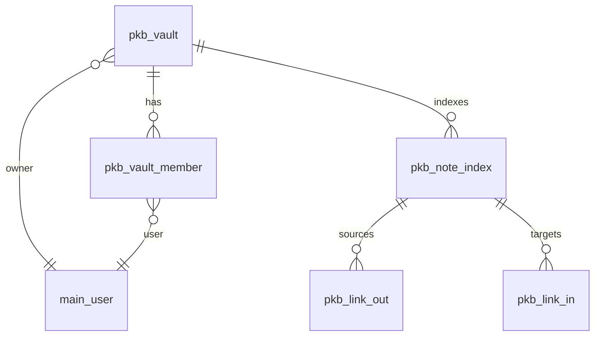
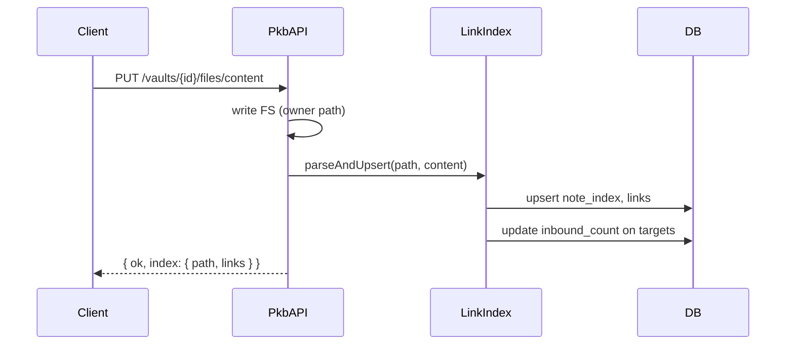

# План разработки приложения «Personal Knowledge Base» (PKB / Vault)

> Версия: 1.0 · Дата: 2026-08-17  
> Репозиторий: XOS monorepo (`server/` Symfony 7, `client/` React 19 + Mantine)  
> Статус: **готов к передаче Архитектору**

---

## 1. Executive summary

### Цель

Obsidian-подобная система управления знаниями внутри desktop-shell XOS: vault (папка markdown-заметок) → редактор → wikilinks → backlinks → graph view, с опциональным sharing для командных vault.

### Адаптация ТЗ к XOS (не Electron)

| ТЗ заказчика | Решение XOS |
|--------------|-------------|
| Локальная ФС напрямую | **Explorer VFS** (`home://`, CRUD через `/api/explorer/*`) |
| Electron/Capacitor shell | **React app** `client/src/apps/pkb/` в window manager |
| `.obsidian/` config | **`.xos-vault/`** внутри корня vault (portable, vendor-neutral) |
| SQLite index локально | **Symfony module `Pkb`** — индекс/граф/sharing в БД; **контент заметок только в файлах** |
| Plugin API v1 | **v2** — MVP без плагинов |

### MVP (фазы 0–4, ~10–14 недель)

| В scope MVP | Out of scope MVP (v2+) |
|-------------|------------------------|
| App `pkb` + `ProtectedAppModules` | Plugin system / extensibility API |
| Vault = папка в `home://` + регистрация в `pkb_vault` | Encryption at-rest |
| CRUD `.md`, nested folders, attachments (images/PDF) | Sync / publish to web |
| Редактор: Live / Source / Reading (reuse markdown viewer) | Mobile UX |
| Wikilinks `[[Note]]`, aliases, `#tags`, embed `![[file]]` (images MVP) | PDF embed preview |
| Backlinks panel + related notes sidebar | AI suggestions |
| Graph View (до ~1000 nodes, filter, zoom) | Real-time collaborative editing |
| Vault-scoped search (1–2s @ 10k notes target) | Global search across all vaults |
| `.xos-vault/` config (bookmarks, last note, graph prefs) | Full Obsidian plugin compatibility |
| Bookmarks, sort/filter file tree | Daily Notes automation (cron) |
| user_app_data prefs (`pkb.ui.*`) | Themes beyond Mantine inherit |

### v2 (фаза 5–6)

- **Sharing vaults**: owner / reader / editor (Todo-like + Board patterns)
- Templates, Daily Notes (date-stamped paths)
- Search/replace across vault
- Background full reindex + incremental graph rebuild
- Hotkeys customization
- Optional group share (Calendar group pattern)

### v3 (backlog)

- Plugin architecture (sandboxed hooks: onSave, onOpen, custom panels)
- Publish / static site export
- Encryption vault
- Mercure live co-editing
- Mobile shell

---

## 2. Архитектурные решения для XOS

### 2.1. Vault = Explorer folder (рекомендация MVP)

**Решение:** контент vault хранится **только в файлах** Explorer VFS. Symfony-модуль `Pkb` — **не дублирует** markdown, а хранит:

- регистрацию vault (metadata + root path)
- ACL membership (sharing)
- search/graph **index cache** (derived data)

```
home://Vaults/{slug}/          ← корень vault (owner)
├── .xos-vault/
│   ├── config.json            ← vault settings (portable)
│   ├── bookmarks.json
│   └── templates/             ← v2
├── Notes/
│   └── my-note.md
└── attachments/
    └── diagram.png
```

**Почему не отдельный storage-модуль:**

- Уже есть Explorer CRUD, trash, upload, permissions
- Data ownership / no vendor lock-in — plain `.md` on disk
- Markdown viewer уже интегрирован с Explorer

**Почему нужен backend `Pkb` (не только FE):**

- Индекс wikilinks/backlinks/graph @ 10k notes — client-only scan слишком медленный
- Sharing требует ACL поверх чужого `home://` path
- Единая точка invalidation index on save

### 2.2. Модуль Symfony `Pkb`

**Образец:** `Todo` (simple share), `Board` (membership), `Explorer` (files).

```
server/src/Pkb/
├── config/
│   ├── routes.yaml
│   ├── services.yaml
│   └── packages/
│       ├── doctrine.yaml
│       └── security.yaml
├── Controller/
├── Entity/
├── Repository/
├── Service/
│   ├── PkbManager.php           # vault CRUD, register path
│   ├── VaultPathResolver.php    # owner home path → absolute FS
│   ├── VaultFileService.php     # proxy read/write/list с ACL
│   ├── LinkIndexService.php     # parse md → upsert index
│   ├── GraphService.php         # nodes/edges from index
│   ├── SearchService.php        # vault-scoped FTS
│   └── PermissionResolver.php
├── Security/Voter/
│   └── VaultVoter.php
├── Parser/
│   └── WikilinkParser.php       # shared spec §4
└── setting.json
```

**Автоподключение:** как Board — `Kernel::configureRoutes()`, `services.yaml` imports, doctrine mapping.

### 2.3. File access: personal vs shared vault

| Сценарий | File I/O |
|----------|----------|
| **Personal vault** (owner) | Client может напрямую `/api/explorer/*` на `root_path` **или** `/api/pkb/vaults/{id}/files/*` (единый ACL слой) |
| **Shared vault** (member) | **Только** `/api/pkb/vaults/{id}/files/*` — сервер резолвит path в FS владельца и проверяет `pkb_vault_member` |

`VaultFileService` внутри использует тот же `FileManager`/Explorer infrastructure, но impersonates owner path.

### 2.4. Indexing strategy (search + graph)

| Trigger | Действие |
|---------|----------|
| **On save** | `PUT .../files/content` → parse wikilinks/tags → upsert `pkb_note_index`, `pkb_link`, rebuild affected graph edges |
| **On rename/move/delete** | Update `path` in index; re-link targets; queue stale link cleanup |
| **On vault open** (client) | `GET /vaults/{id}/index/status` — если `stale`, показать «Reindexing…» |
| **Background full scan** | `POST /vaults/{id}/index/rebuild` — walk all `.md`, batch upsert (admin/owner) |

**MVP indexing scope:** title (first `#` or filename), outbound links, tags, mtime. Full-text body in `pkb_note_index.content_hash` + `body_excerpt` (first 500 chars) for search preview.

**Performance target:** incremental index on save <200ms; full rebuild 10k notes <60s background.

### 2.5. Интеграция apps registry (клиент)

| Шаг | Файл / механизм |
|-----|-----------------|
| Манифест | `client/src/apps/pkb/index.ts` — auto-discovery [`registerApps.ts`](../../client/src/core/appManager/registerApps.ts) |
| Gate | `canAccess: () => canUsePkb()` → `canUseAppModule('pkb')` |
| API | `client/src/core/api/endpoints/pkbApi.ts` (Zod + axios) |
| Query keys | `client/src/core/api/queryKeys.ts` — секция `pkb` |
| Feature UI | `client/src/features/pkb/` |
| UI prefs | `user_app_data`: `pkb.ui.lastVaultId`, `pkb.ui.sidebarWidth`, `pkb.ui.graphLayout` |
| Vault-local prefs | `.xos-vault/config.json` (portable with vault folder) |

### 2.6. ProtectedAppModules

```json
// server/src/Pkb/setting.json
{
  "name": "PKB",
  "claimant": { "pkb": "Knowledge Base" },
  "map-access": {
    "can_read": { "bit": 1, "title": "Чтение" },
    "can_write": { "bit": 2, "title": "Запись" }
  }
}
```

- `can_read` / `can_write` (claimant) = доступ к **app PKB**
- Vault-level reader/editor — через `pkb_vault_member`, не bitmask

Добавить `'pkb'` в [`ProtectedAppModules.php`](../../server/src/App/Security/ProtectedAppModules.php) и [`protectedApps.ts`](../../client/src/core/auth/protectedApps.ts). Deploy: `main:claimant:sync`.

### 2.7. Relationship to Explorer & markdown viewer

| Компонент | Стратегия |
|-----------|-----------|
| `explorer-markdown-viewer` | **Reuse, не fork.** Вынести shared editor в `client/src/features/markdown/` (Phase 2 refactor) |
| Explorer file tree | PKB sidebar — **свой tree** на базе `GET /api/pkb/vaults/{id}/files/tree` (фильтр `.md`, attachments) |
| Open in Explorer | Context menu «Show in Explorer» → open path in explorer app |
| Satellite pattern | PKB **не** satellite; standalone app с embedded editor |

**Reuse list:**

- `MarkdownWysiwygEditor`, `MarkdownPreview`, `markdownViewMode`, `markdownEditorStore` patterns
- `fetchExplorerText` / save logic → abstract to `VaultFileApi` interface (explorer vs pkb endpoints)

**PKB-specific additions:**

- Wikilink autocomplete extension (TipTap suggestion)
- Click handler `[[link]]` → navigate inside vault
- Backlinks / graph panels

### 2.8. Graph library (frontend)

**Рекомендация MVP:** [`react-cytoscapejs`](https://github.com/plotly/react-cytoscapejs) + `cytoscape` (layout: `cose`, `fcose` for 1k nodes).

Альтернатива v2: `react-force-graph` (3D, prettier, хуже @ 10k).

---

## 3. Модель данных

**Принцип:** note content = `.md` file only. DB = registry + derived index + sharing.

### 3.1. Диаграмма



### 3.2. Таблицы

#### `pkb_vault`

| Column | Type | Notes |
|--------|------|-------|
| id | INT PK | |
| owner_id | INT FK → main_user | |
| name | VARCHAR(255) | Display name |
| slug | VARCHAR(64) | URL-safe, unique per owner |
| root_path | VARCHAR(512) | e.g. `home://Vaults/my-vault` |
| is_personal | TINYINT(1) DEFAULT 1 | 0 = team vault |
| created_at | DATETIME | |
| updated_at | DATETIME | |
| index_version | INT DEFAULT 0 | bump on rebuild |
| index_stale | TINYINT(1) DEFAULT 0 | |

**Indexes:** `UNIQ_pkb_vault_owner_slug (owner_id, slug)`, `IDX_pkb_vault_owner`

#### `pkb_vault_member`

| Column | Type | Notes |
|--------|------|-------|
| id | INT PK | |
| vault_id | INT FK → pkb_vault CASCADE | |
| user_id | INT FK → main_user CASCADE | |
| role | ENUM('reader','editor') | MVP; v2: admin |
| created_at | DATETIME | |

**Unique:** `(vault_id, user_id)`

#### `pkb_note_index`

Derived cache; rebuildable from files.

| Column | Type | Notes |
|--------|------|-------|
| id | INT PK | |
| vault_id | INT FK | |
| path | VARCHAR(512) | relative to vault root, e.g. `Notes/foo.md` |
| title | VARCHAR(255) | parsed or filename |
| tags | JSON | `["tag1","tag2"]` |
| outbound_count | INT | denorm |
| inbound_count | INT | denorm |
| content_hash | CHAR(64) | SHA-256 body |
| body_excerpt | VARCHAR(500) NULL | search preview |
| mtime | DATETIME | from FS |
| indexed_at | DATETIME | |

**Unique:** `(vault_id, path)`  
**Index:** `IDX_pkb_note_vault_title (vault_id, title)`, FULLTEXT on `(title, body_excerpt)` MySQL 8+

#### `pkb_link`

| Column | Type | Notes |
|--------|------|-------|
| id | INT PK | |
| vault_id | INT FK | |
| source_path | VARCHAR(512) | |
| target_key | VARCHAR(255) | normalized wikilink target |
| target_path | VARCHAR(512) NULL | resolved path if exists |
| link_type | ENUM('wikilink','embed','tag') | tag edges optional for graph |
| alias | VARCHAR(255) NULL | display alias |
| position | INT NULL | char offset in source |

**Indexes:** `IDX_pkb_link_target (vault_id, target_key)`, `IDX_pkb_link_source (vault_id, source_path)`

#### Не в MVP DB

- `pkb_attachment` — attachments = plain files in vault folder
- Plugin registry — v2

### 3.3. `.xos-vault/config.json` (portable)

```json
{
  "version": 1,
  "defaultNoteFolder": "Notes",
  "attachmentFolder": "attachments",
  "dailyNotes": { "enabled": false, "format": "YYYY-MM-DD", "folder": "Daily" },
  "wikilink": { "caseSensitive": false, "extension": ".md" }
}
```

Synced to DB on vault register/update; file wins on conflict (Architect: merge policy).

---

## 4. Wikilink parser spec

**Module:** `Pkb\Parser\WikilinkParser` (+ shared TS port for client autocomplete).

### 4.1. Syntax

| Construct | Pattern | Example |
|-----------|---------|---------|
| Wikilink | `\[\[([^\]|#]+)(?:#([^\]|]+))?(?:\|([^\]]+))?\]\]` | `[[Note]]`, `[[Note#Heading]]`, `[[Note\|Alias]]` |
| Embed | `!\[\[([^\]|#]+)(?:\|([^\]]+))?\]\]` | `![[image.png]]`, `![[Note]]` |
| Tag | `(?<![\w])#([a-zA-Z][\w/-]*)` | `#project`, `#area/work` |

### 4.2. Resolution rules

1. **Normalize target key:** trim, collapse spaces, optional case-fold per vault config.
2. **Resolve path:** search order — exact path match → `{defaultNoteFolder}/{title}.md` → any `{title}.md` in vault (Ambiguity → unresolved, show in UI).
3. **Rename/move:** update `pkb_note_index.path`; links by `target_key` re-resolve on next index.
4. **Broken links:** `target_path IS NULL` — show dashed in graph, strikethrough in preview.

### 4.3. Embeds (MVP)

- Image extensions (`.png`, `.jpg`, `.gif`, `.webp`, `.svg`): render inline via `/api/pkb/vaults/{id}/files/content?path=`
- Other embeds: fallback link card «Open note/file»

### 4.4. TipTap integration (client)

- Input rule: `[[` triggers autocomplete (fuse.js on note titles from index)
- Render: custom node `wikilink` → Mantine `Anchor` internal navigate
- Source mode: leave raw `[[...]]` intact

---

## 5. Graph index

### 5.1. Build

```
nodes = SELECT path, title, inbound_count, tags FROM pkb_note_index WHERE vault_id = ?
edges = SELECT source_path, target_path FROM pkb_link
        WHERE vault_id = ? AND link_type IN ('wikilink','embed') AND target_path IS NOT NULL
```

Optional tag nodes (v2): `#tag` as hexagon node linked to notes.

### 5.2. Update flow



### 5.3. Client graph query

`GET /api/pkb/vaults/{id}/graph?filter=tag:project&limit=1000`

Response:

```json
{
  "nodes": [{ "id": "Notes/a.md", "title": "A", "degree": 5, "tags": [] }],
  "edges": [{ "source": "Notes/a.md", "target": "Notes/b.md", "type": "wikilink" }]
}
```

Layout computed client-side (Cytoscape). Persist viewport in `user_app_data` `pkb.ui.graph.{vaultId}`.

---

## 6. Sharing model

### 6.1. Roles (MVP)

| Role | Read notes | Edit notes | File CRUD | Invite members | Delete vault |
|------|:----------:|:----------:|:---------:|:--------------:|:------------:|
| **owner** | ✓ | ✓ | ✓ | ✓ | ✓ |
| **editor** | ✓ | ✓ | ✓ | — | — |
| **reader** | ✓ | — | — | — | — |

Pattern: **Todo** `read`/`write` semantics + **Board** member list UI.

### 6.2. Flow

1. Owner creates vault → files in own `home://`
2. Owner invites `{ email, role: reader|editor }` → `pkb_vault_member`
3. Member sees vault in PKB dashboard (`GET /api/pkb/vaults` includes shared)
4. Member file ops → `VaultFileService` checks role:
   - reader: GET only
   - editor: GET, PUT, POST (create), PATCH (rename), DELETE

### 6.3. Explorer visibility

Shared members **не** получают прямой доступ к owner `home://` в Explorer app (security). Только через PKB API.

### 6.4. v2 extensions

- Group share (`main_group`) — как Calendar `CalendarGroupShare`
- Transfer ownership
- Public read-only link (token) — out of MVP

---

## 7. API endpoints

Prefix: **`/api/pkb`**. JWT required. Module gate: `#[Access('pkb')]`.

### 7.1. Vaults

| Method | Path | Описание |
|--------|------|----------|
| GET | `/vaults` | List owned + shared vaults |
| POST | `/vaults` | Create/register `{ name, rootPath? }` — creates folder if missing |
| GET | `/vaults/{id}` | Detail + config + permissions |
| PUT | `/vaults/{id}` | Update name, config |
| DELETE | `/vaults/{id}` | Unregister (optional delete files flag) |
| GET | `/vaults/{id}/members` | List members (owner) |
| POST | `/vaults/{id}/members` | Invite `{ email, role }` |
| PUT | `/vaults/{id}/members/{userId}` | Change role |
| DELETE | `/vaults/{id}/members/{userId}` | Remove |

### 7.2. Files (vault-scoped)

| Method | Path | Описание |
|--------|------|----------|
| GET | `/vaults/{id}/files/tree?path=` | Tree (md + folders) |
| GET | `/vaults/{id}/files/list?path=` | Flat list |
| GET | `/vaults/{id}/files/content?path=` | Read file |
| PUT | `/vaults/{id}/files/content` | Write `{ path, content }` + **index** |
| POST | `/vaults/{id}/files/folder` | Create folder |
| POST | `/vaults/{id}/files/upload` | Multipart attachment |
| PATCH | `/vaults/{id}/files/rename` | Rename/move |
| DELETE | `/vaults/{id}/files/item?path=` | Delete |

### 7.3. Index, links, graph, search

| Method | Path | Описание |
|--------|------|----------|
| GET | `/vaults/{id}/notes` | Indexed notes `{ q?, tag?, sort? }` |
| GET | `/vaults/{id}/notes/by-title?title=` | Resolve wikilink target |
| GET | `/vaults/{id}/backlinks?path=` | Inbound links |
| GET | `/vaults/{id}/graph` | Nodes + edges |
| GET | `/vaults/{id}/search?q=` | Full-text vault search |
| POST | `/vaults/{id}/index/rebuild` | Full reindex (owner) |
| GET | `/vaults/{id}/index/status` | `{ stale, noteCount, lastIndexedAt }` |

### 7.4. Utility

| Method | Path | Описание |
|--------|------|----------|
| GET | `/users/by-email?email=` | Invite lookup (reuse Main/Todo pattern) |

---

## 8. Frontend structure

```
client/src/apps/pkb/
├── index.ts                 # AppManifest id: 'pkb'
├── PkbApp.tsx               # vault picker | vault workspace
├── PkbIcon.tsx
└── pages/
    ├── VaultDashboardPage.tsx
    └── VaultWorkspacePage.tsx

client/src/features/pkb/
├── pkbAccess.ts
├── api/                     # hooks wrapping pkbApi
├── components/
│   ├── VaultSidebar.tsx     # file tree, bookmarks
│   ├── NoteEditorPanel.tsx  # wraps features/markdown
│   ├── BacklinksPanel.tsx
│   ├── RelatedNotesPanel.tsx
│   ├── GraphView.tsx        # cytoscape
│   ├── VaultSearch.tsx
│   ├── TagBadgeList.tsx
│   └── ShareVaultModal.tsx  # v2 phase
├── editor/
│   ├── wikilinkExtension.ts
│   └── useWikilinkNavigate.ts
├── hooks/
│   ├── useVaultQuery.ts
│   ├── useNoteSave.ts       # save + invalidate backlinks/graph
│   └── useVaultTree.ts
└── stores/
    └── pkbUiStore.ts        # active note, panels, layout

client/src/features/markdown/   # extracted from explorer-markdown-viewer
├── MarkdownWysiwygEditor.tsx
├── MarkdownPreview.tsx
├── markdownViewMode.ts
└── useMarkdownEditor.ts
```

### 8.1. Экраны

| Экран | Компонент |
|-------|-----------|
| Dashboard | `VaultDashboardPage` — create/open vault |
| Workspace | `VaultWorkspacePage` — sidebar + editor + optional right panels |
| Graph | split pane or separate wm window `pkb-graph` (v1: split pane) |

### 8.2. Layout (MVP)

```
┌─────────────┬──────────────────────────┬─────────────┐
│ File tree   │ Editor (live/src/read)   │ Backlinks   │
│ Bookmarks   │ Toolbar: save, mode,     │ Tags        │
│ Search      │         graph toggle     │ Related     │
└─────────────┴──────────────────────────┴─────────────┘
         Graph panel (collapsible bottom or tab)
```

---

## 9. Plugin architecture sketch (v2)

**Не MVP.** Концепт для Architect backlog:

```typescript
interface PkbPlugin {
  id: string;
  onNoteSave?(ctx: { vaultId; path; content }): void;
  registerCommands?(): Command[];
  registerSidebarPanel?(): React.ComponentType;
}
```

Load from `.xos-vault/plugins/` as ESM — **security review required** (sandbox iframe or server-side hooks only). MVP: no dynamic code load.

---

## 10. Инкрементный план фаз

### Фаза 0: Scaffolding (1 неделя)

| ID | Задача | Зависимости | Приёмка | Size |
|----|--------|-------------|---------|------|
| PKB-001 | Skeleton `server/src/Pkb/` (config, routes, doctrine) | — | `doctrine:schema:validate` OK | S |
| PKB-002 | `Pkb/setting.json` + claimant sync | PKB-001 | `main:claimant:sync --dry-run` | S |
| PKB-003 | `pkb` in ProtectedAppModules BE+FE | PKB-002 | Unit test protectedApps | S |
| PKB-004 | `client/src/apps/pkb/index.ts` + stub app | PKB-003 | App in Start Menu | S |
| PKB-005 | `pkbApi.ts` stub + queryKeys | PKB-004 | Vitest schema parse | S |

### Фаза 1: Vault & files (2 недели)

| ID | Задача | Зависимости | Приёмка | Size |
|----|--------|-------------|---------|------|
| PKB-010 | Migration: `pkb_vault` | PKB-001 | migrate OK | S |
| PKB-011 | Vault CRUD API + create folder on disk | PKB-010 | PHPUnit create/list | M |
| PKB-012 | `VaultPathResolver` + `VaultFileService` (owner) | PKB-011 | read/write/list tree | M |
| PKB-013 | `.xos-vault/config.json` init on create | PKB-011 | config file exists | S |
| PKB-014 | Dashboard UI: create/open vault | PKB-005, PKB-011 | manual flow | M |
| PKB-015 | Vault sidebar file tree | PKB-012, PKB-014 | navigate folders | M |

### Фаза 2: Editor integration (2 недели)

| ID | Задача | Зависимости | Приёмка | Size |
|----|--------|-------------|---------|------|
| PKB-020 | Extract `features/markdown/` from explorer-markdown-viewer | PKB-004 | explorer-markdown-viewer still works | M |
| PKB-021 | `NoteEditorPanel` in PKB workspace | PKB-015, PKB-020 | edit/save .md via pkb files API | M |
| PKB-022 | View modes live/source/reading | PKB-021 | 3 modes switch | S |
| PKB-023 | Attachments upload in vault folder | PKB-012 | image upload + link in md | M |
| PKB-024 | user_app_data: last vault, sidebar width | PKB-014 | prefs restore | S |

### Фаза 3: Wikilinks & backlinks (2–3 недели) — **критический путь**

| ID | Задача | Зависимости | Приёмка | Size |
|----|--------|-------------|---------|------|
| PKB-030 | Migration: `pkb_note_index`, `pkb_link` | PKB-010 | migrate OK | M |
| PKB-031 | `WikilinkParser` PHP + unit tests | PKB-030 | spec §4 cases | M |
| PKB-032 | `LinkIndexService` on save | PKB-031, PKB-012 | save → index updated | M |
| PKB-033 | `GET /backlinks`, `/notes/by-title` | PKB-032 | backlink panel data | M |
| PKB-034 | TipTap wikilink extension + autocomplete | PKB-020, PKB-033 | insert `[[` completes | L |
| PKB-035 | Click wikilink → open note | PKB-034 | navigate works | M |
| PKB-036 | Backlinks + tags sidebar UI | PKB-033, PKB-021 | panel shows inbound | M |

### Фаза 4: Graph & search (2 недели) — **критический путь**

| ID | Задача | Зависимости | Приёмка | Size |
|----|--------|-------------|---------|------|
| PKB-040 | `GraphService` + `GET /graph` | PKB-032 | JSON nodes/edges | M |
| PKB-041 | Install cytoscape + `GraphView.tsx` | PKB-040 | render 500 nodes smooth | M |
| PKB-042 | Graph filter by tag + zoom/pan | PKB-041 | filter works | M |
| PKB-043 | Click graph node → open note | PKB-041, PKB-035 | navigation | S |
| PKB-044 | `SearchService` + vault search UI | PKB-032 | search <2s @ 1k notes | M |
| PKB-045 | `POST /index/rebuild` + stale indicator | PKB-032 | full reindex works | M |
| PKB-046 | E2E smoke: vault → edit → link → backlink → graph | PKB-043 | playwright green | M |

### Фаза 5: Sharing (2 недели, v2 boundary — можно slip после MVP demo)

| ID | Задача | Зависимости | Приёмка | Size |
|----|--------|-------------|---------|------|
| PKB-050 | Migration: `pkb_vault_member` | PKB-010 | migrate OK | S |
| PKB-051 | Member invite API + PermissionResolver | PKB-050, PKB-012 | reader/editor matrix tests | M |
| PKB-052 | Shared vault file ACL in VaultFileService | PKB-051 | member write blocked for reader | M |
| PKB-053 | ShareVaultModal UI | PKB-051 | invite by email | M |

### Фаза 6: Polish & v2 features (2+ недели)

| ID | Задача | Зависимости | Приёмка | Size |
|----|--------|-------------|---------|------|
| PKB-060 | Bookmarks (`.xos-vault/bookmarks.json` + UI) | PKB-014 | add/remove bookmark | S |
| PKB-061 | Templates folder + «New from template» | PKB-013 | create note from tpl | M |
| PKB-062 | Daily Notes | PKB-061 | open/create today note | M |
| PKB-063 | Search/replace across vault | PKB-044 | replace all in vault | M |
| PKB-064 | Performance: 10k notes benchmark | PKB-045 | doc results | M |
| PKB-065 | Docs: API_SPEC + DEVELOPER_GUIDE | PKB-046 | review | S |

### Граф зависимостей (критический путь MVP)

```
PKB-001 → PKB-010 → PKB-011 → PKB-012 → PKB-015 → PKB-021 → PKB-032 → PKB-036 → PKB-040 → PKB-041 → PKB-046
         ↓                              ↓
       PKB-014 ──────────────────────────┘
PKB-003 → PKB-004 → PKB-005 → PKB-020 ──┘
```

**MVP critical path:** PKB-001 → PKB-011 → PKB-012 → PKB-021 → PKB-032 → PKB-036 → PKB-040 → PKB-041 → PKB-046

---

## 11. MVP checklist

### Обязательно в MVP

- [ ] App «PKB» в меню, gate через `ProtectedAppModules`
- [ ] Create/open vault (Explorer folder + DB registry)
- [ ] File tree + CRUD `.md` + nested folders
- [ ] Editor: Live / Source / Reading (shared markdown feature)
- [ ] Save triggers link index update
- [ ] Wikilinks `[[note]]`, `[[note|alias]]`, `#tags`
- [ ] Backlinks panel
- [ ] Graph view (interactive, filter, zoom)
- [ ] Vault-scoped search
- [ ] Attachments (images)
- [ ] `.xos-vault/` config folder

### Отложено (v2+)

- [ ] Vault sharing (reader/editor)
- [ ] Templates & Daily Notes
- [ ] Search/replace across vault
- [ ] Plugin system
- [ ] Encryption
- [ ] Sync/publish
- [ ] Mobile
- [ ] PDF embed preview

---

## 12. Риски и открытые вопросы

### 12.1. Зафиксированные архитектурные решения

| # | Вопрос | Решение |
|---|--------|---------|
| A1 | Vault = VFS folder или DB blob? | **VFS folder** + DB index/sharing only |
| A2 | Отдельный app или расширить Explorer? | **Отдельный app `pkb`**, reuse explorer/markdown libs |
| A3 | Sharing через Explorer ACL? | **Нет** — PKB API proxy на owner path |
| A4 | Graph library | **Cytoscape** MVP |
| A5 | Plugin API | **v2** |

### 12.2. Открытые вопросы (Architect / Product)

| # | Вопрос | Default если нет ответа |
|---|--------|-------------------------|
| Q1 | Default vault location | `home://Vaults/{slug}` |
| Q2 | Ambiguous wikilink title (2 files same title) | First by path sort; UI picker on click |
| Q3 | Delete vault — удалять файлы или только unregister? | Modal choice; default unregister only |
| Q4 | Sharing in MVP или v2? | **v2** (после graph demo); design ready §6 |
| Q5 | Extract markdown to shared feature — breaking explorer-markdown-viewer? | Thin re-export; no behavior change |
| Q6 | FULLTEXT MySQL vs LIKE for MVP search | FULLTEXT if MySQL 8+; else LIKE + warn @10k |
| Q7 | Graph: tag nodes in MVP? | Notes only; tag filter without tag nodes |
| Q8 | Single vault per window or multi-tab? | Single active note; multi window via wm |
| Q9 | Wikilink extension in source mode — autocomplete? | MVP: wysiwyg + reading click; source v2 |
| Q10 | Attachment size limit | Explorer upload limit (Architect: align with Board) |

### 12.3. Технические риски

| Риск | Вероятность | Митигация |
|------|-------------|-----------|
| Index drift vs FS | Средняя | `index/stale` flag + rebuild; hash on save |
| Shared vault FS access leak | Высокая | All shared ops via VaultFileService; PHPUnit ACL |
| Graph perf @10k nodes | Средняя | Limit render 1000 + filter; WebGL layout v2 |
| Wikilink rename orphan links | Средняя | Re-resolve by target_key on index |
| Markdown extract breaks viewer | Средняя | PKB-020 with regression test |
| 64KB user_app_data for graph state | Низкая | Store viewport only; not graph data |

### 12.4. Ссылки на паттерны проекта

| Concern | Reference |
|---------|-----------|
| Explorer VFS API | [`server/src/Explorer/Controller/`](../../server/src/Explorer/Controller/), [`explorerApi.ts`](../../client/src/features/explorer/explorerApi.ts) |
| Markdown viewer | [`client/src/apps/explorer-markdown-viewer/`](../../client/src/apps/explorer-markdown-viewer/) |
| Todo share | [`TodoListShare`](../../server/src/Todo/Entity/TodoListShare.php) |
| Board members | [`Board/PermissionResolver.php`](../../server/src/Board/Service/PermissionResolver.php) |
| user_app_data | [`docs/ADR-user-app-data.md`](../ADR-user-app-data.md) |
| Board plan template | [`docs/board/PLAN.md`](../board/PLAN.md) |
| Claimants | [`docs/MIGRATIONS.md`](../MIGRATIONS.md) |

---

## 13. Test plan

### 13.1. Backend (PHPUnit)

**Location:** `server/tests/Pkb/`

| Suite | Cases |
|-------|-------|
| `VaultApiTest` | CRUD, auth 401, owner-only delete |
| `VaultFileApiTest` | read/write/tree, path traversal blocked |
| `WikilinkParserTest` | spec §4 syntax edge cases |
| `LinkIndexServiceTest` | save → links; rename → update |
| `BacklinksApiTest` | inbound links correct |
| `GraphApiTest` | nodes/edges count |
| `SearchApiTest` | find by title/body |
| `VaultMemberApiTest` | invite, reader cannot write — **phase 5** |
| `PermissionResolverTest` | owner/editor/reader matrix |

### 13.2. Frontend (Vitest)

**Location:** `client/src/features/pkb/__tests__/`

| File | Cases |
|------|-------|
| `pkbAccess.test.ts` | canUsePkb gate |
| `pkbApi.test.ts` | Zod schemas |
| `wikilinkParser.test.ts` | TS parser parity with PHP |
| `graphLayout.test.ts` | cytoscape elements builder |

### 13.3. E2E (Playwright)

**Location:** `client/e2e/pkb.spec.ts`

| Scenario | Steps |
|----------|-------|
| Gate | User without pkb role → app hidden |
| **Critical path** | Create vault → new note → type `[[Other]]` → create Other → save → backlinks show → open graph → click node |
| Search | Search title → open result |
| Modes | Toggle live/source/reading |

### 13.4. Manual QA (pre-release)

- [ ] `main:claimant:sync` on clean DB
- [ ] User settings: enable PKB → app appears
- [ ] 1000 notes import — search acceptable
- [ ] Graph 500 nodes — pan/zoom smooth
- [ ] Rename linked note — backlinks persist
- [ ] Dark/light theme inherited

---

## Следующие шаги

### Для Архитектора

1. Закрыть Q1–Q10 (§12.2), особенно Q4 (sharing in MVP scope)
2. Детализировать `VaultFileService` ↔ Explorer `FileManager` integration
3. DTO для `GET /vaults/{id}/graph` и save response with index delta
4. FULLTEXT vs LIKE decision (Q6)
5. Wikilink ambiguity UX (Q2)
6. Draft `docs/API_SPEC.md` § PKB from §7

### Для Оркестратора

1. Старт **Фазы 0** (PKB-001…PKB-005)
2. Parallel: PKB-010…PKB-015 after Architect sign-off
3. Tester с PKB-031 (parser tests)
4. Critical path milestone: PKB-046 before Phase 5 sharing

---

*Документ создан планировщиком XOS на основе анализа Explorer VFS, explorer-markdown-viewer, Todo/Calendar/Board sharing, ADR user_app_data, docs/board/PLAN.md.*
